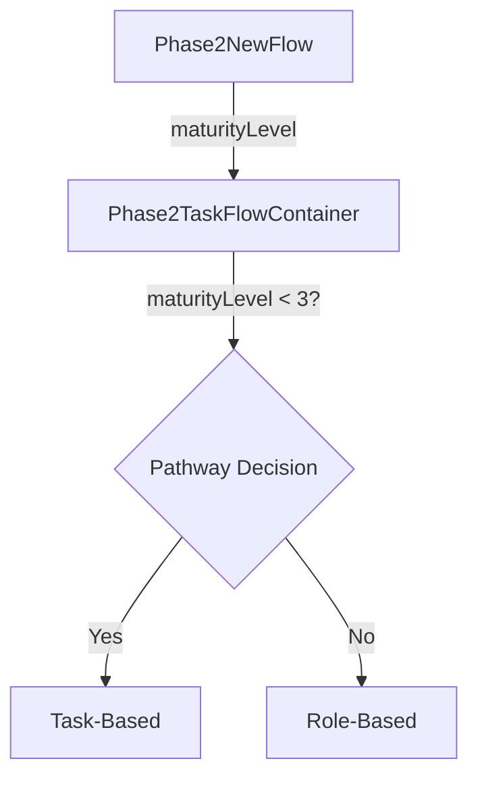
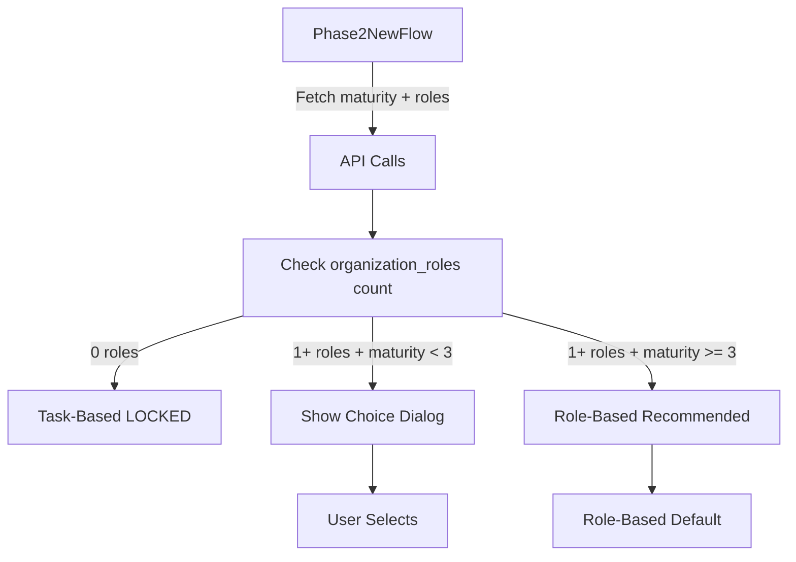

# Phase 2 Pathway Selection Analysis & Fixes

**Date**: 2025-11-01
**Status**: Issues Identified, Fixes Pending

---

## Executive Summary

The current Phase 2 pathway selection logic has **critical design flaws**:
- ❌ Uses maturity level instead of role availability
- ❌ Allows switching pathways when organization has no roles
- ❌ Provides misleading error messages
- ❌ Blocks user from retrying when LLM fails
- ❌ LLM produces inconsistent results

---

## Issue 1: WRONG Pathway Selection Logic

### Current (INCORRECT) Logic
```javascript
// Phase2TaskFlowContainer.vue line 107-110
const pathway = computed(() => {
  const isTaskBased = props.maturityLevel < MATURITY_THRESHOLD  // WRONG!
  return isTaskBased ? 'TASK_BASED' : 'ROLE_BASED'
})
```

**Problem**: Decision based ONLY on maturity level. This is conceptually wrong!

### Correct Logic (Per Requirements)

**Task-Based Pathway**: Organization has NOT completed Phase 1 Task 2 (Role Identification)
- Criteria: `organization_roles` table has 0 roles for this organization
- Behavior: LOCKED to task-based (no switching allowed)

**Role-Based Pathway**: Organization HAS completed Phase 1 Task 2
- Criteria: `organization_roles` table has 1+ roles for this organization
- Behavior: Can use role-based OR optionally task-based

### Evidence from Codebase

From `TASK_BASED_ASSESSMENT_STATUS.md`:
```
Use Case 1: Phase 1 Task 2 - ROLE IDENTIFICATION
Purpose: Organizations describe job profiles → AI maps to standard SE roles

Flow:
User enters tasks → AI analyzes → Maps to ISO processes → Suggests SE role →
User confirms → Creates organization_role → Used for Phase 2
```

This clearly shows:
- Phase 1 creates `organization_roles` records
- Phase 2 should check if these exist

### Example Scenarios

| Maturity | Roles Defined? | Current Behavior | Correct Behavior |
|----------|---------------|------------------|------------------|
| 2 | No | Task-based ✓ | Task-based (locked) ✓ |
| 2 | Yes | Task-based ✗ | User choice (role-based recommended) |
| 3 | No | Role-based ✗ | Task-based (locked) |
| 3 | Yes | Role-based ✓ | Role-based ✓ |

---

## Issue 2: Inappropriate "Switch to Role-Based" Option

### Problematic Code Locations

**1. DerikTaskSelector.vue line 303**:
```javascript
errorMessage.value = 'Failed to analyze your tasks. Please try again or switch to role-based selection.'
```

**2. DerikTaskSelector.vue line 322**:
```javascript
ElMessage.warning('No processes identified. Please try again or switch to role-based selection.')
```

**3. Emit definition (line 163)**:
```javascript
const emit = defineEmits(['tasksAnalyzed', 'switchToRoleBased'])
```

**4. Handler exists (Phase2TaskFlowContainer line 271-274)**:
```javascript
const handleSwitchToRoleBased = () => {
  console.log('[Phase2 Flow] Switching to role-based pathway')
  currentStep.value = 'role-selection'  // This should NOT be allowed if no roles!
}
```

### Problem

When organization has NO defined roles:
- ❌ Error message says "switch to role-based selection"
- ❌ Switching handler exists and works
- ❌ User can switch to role-selection step
- ❌ Role selection step will show 0 roles → deadlock!

### Fix Needed

1. **Add role availability check**:
```javascript
// New API endpoint needed
GET /api/organization/{org_id}/has-roles
Response: { has_roles: boolean, role_count: number }
```

2. **Pass to DerikTaskSelector**:
```vue
<DerikTaskSelector
  :organization-id="organizationId"
  :username="taskBasedUsername"
  :can-switch-to-roles="hasOrganizationRoles"  <!-- NEW PROP -->
  @tasksAnalyzed="handleTasksAnalyzed"
  @switchToRoleBased="handleSwitchToRoleBased"
/>
```

3. **Conditional messages**:
```javascript
// If canSwitchToRoles is true:
errorMessage.value = 'Failed to analyze your tasks. Please try again or switch to role-based selection.'

// If canSwitchToRoles is false:
errorMessage.value = 'Failed to analyze your tasks. Please refine your task descriptions and try again.'
```

---

## Issue 3: Button Doesn't Work When No Processes

### Current Code (DerikTaskSelector.vue line 321-324)
```javascript
const proceedToAssessment = () => {
  if (filteredProcessResult.value.length === 0) {
    ElMessage.warning('No processes identified. Please try again or switch to role-based selection.')
    return  // ❌ BLOCKS PROCEEDING
  }

  emit('tasksAnalyzed', { ... })
}
```

### filteredProcessResult Logic (line 185-189)
```javascript
const filteredProcessResult = computed(() => {
  return processResult.value.filter(process =>
    process.involvement !== "Not performing"  // Filters out 0-value processes
  )
})
```

### Problem

When LLM marks ALL processes as "Not performing" (value = 0):
1. Backend stores 30 rows with all values = 0
2. Stored procedure calculates competencies: all = 0
3. Frontend filters out all "Not performing" processes
4. `filteredProcessResult.length === 0`
5. Button shows warning and returns WITHOUT emitting
6. User is stuck (button does nothing)

### Root Cause: LLM Inconsistency

**Run 1** (phase2_task_28_1761954922513_66uk7):
```
Tasks: {'supporting': ['Code reviews...', 'Helping...', 'Mentoring...', 'Supporting testing...']}
Result: Integration process = 'Supporting' ✓
```

**Run 2** (phase2_task_28_1761955207440_kt3o8e) - SAME TASKS:
```
Tasks: {'supporting': ['Code reviews...', 'Helping...', 'Mentoring...', 'Supporting testing...']}
Result: ALL 9 processes = 'Not performing' ✗
```

### Fix Options

**Option A: Allow Proceeding with 0 Competencies**
```javascript
const proceedToAssessment = () => {
  if (filteredProcessResult.value.length === 0) {
    ElMessage.warning('No processes identified. This will result in 0 competency requirements.')
    // Continue anyway (don't return)
  }

  emit('tasksAnalyzed', { ... })
}
```

**Option B: Add "Reset and Retry" Button** (RECOMMENDED)
```javascript
const proceedToAssessment = () => {
  if (filteredProcessResult.value.length === 0) {
    showRetryDialog.value = true  // Show dialog with "Edit Tasks" and "Switch" options
    return
  }

  emit('tasksAnalyzed', { ... })
}
```

**Option C: Improve LLM Prompt** (Backend fix)
- Add constraint: "If ANY tasks are provided, at least ONE process must have involvement > 'Not performing'"
- Add examples of minimal involvement scenarios
- Increase temperature slightly for more creativity?

---

## Issue 4: LLM Inconsistency

### Evidence

**Same Input**:
```json
{
  "responsible_for": ["Not responsible for any tasks"],
  "supporting": [
    "Code reviews for junior developers",
    "Helping team members troubleshoot technical issues",
    "Mentoring junior engineers in software best practices",
    "Supporting integration testing activities"
  ],
  "designing": ["Not designing any tasks"]
}
```

**Run 1 Output**:
```
- Integration process: Supporting ✓
- Verification process: Not performing
- Validation process: Not performing
... (9 processes total, 1 with involvement)
```

**Run 2 Output**:
```
- Integration process: Not performing ✗
- Verification process: Not performing
- Validation process: Not performing
... (9 processes total, 0 with involvement)
```

### Why This Happens

1. **LLM Non-Determinism**: GPT models are stochastic (temperature > 0)
2. **Prompt Ambiguity**: No strict constraint requiring minimal involvement
3. **Context Window**: Slight variations in token count may affect reasoning
4. **No Few-Shot Examples**: Prompt doesn't show examples of minimal involvement

### Potential Backend Fixes

**File**: `src/backend/app/services/llm_pipeline/llm_process_identification_pipeline.py`

**1. Add Constraint to Prompt**:
```python
# In the system prompt, add:
"""
IMPORTANT: If the user provides ANY tasks in 'supporting', 'responsible_for',
or 'designing', you MUST identify at least ONE process with involvement level
higher than 'Not performing'.

Example: If user mentions 'code reviews' in supporting tasks, they are at
minimum Supporting the Verification process.
"""
```

**2. Add Few-Shot Examples**:
```python
# Add example scenarios:
examples = [
    {
        "input": {"supporting": ["code reviews", "testing support"]},
        "output": {"Verification process": "Supporting"}
    },
    {
        "input": {"supporting": ["mentoring junior engineers"]},
        "output": {"Infrastructure Management process": "Supporting"}
    }
]
```

**3. Post-Process Validation**:
```python
def validate_involvement_output(result, tasks):
    # If tasks provided but all processes = "Not performing", retry with stricter prompt
    has_tasks = any(tasks.get(k) and tasks[k] != [f"Not {k.replace('_', ' ')} any tasks"]
                   for k in ['responsible_for', 'supporting', 'designing'])

    all_not_performing = all(p.involvement == "Not performing" for p in result.processes)

    if has_tasks and all_not_performing:
        print("[WARNING] LLM marked all as 'Not performing' despite tasks provided. Retrying...")
        # Retry with more explicit prompt
        return retry_with_strict_prompt(tasks)

    return result
```

---

## Issue 5: No Frontend Check for Role Availability

### Current Flow



**Problem**: Never checks if roles actually exist!

### Correct Flow



### New API Endpoint Needed

**File**: `src/backend/app/routes.py`

```python
@main_bp.route('/api/organization/<int:org_id>/role-availability', methods=['GET'])
def check_role_availability(org_id):
    """
    Check if organization has defined roles from Phase 1

    Returns:
        {
            "has_roles": boolean,
            "role_count": number,
            "can_use_role_based": boolean,
            "can_use_task_based": boolean,
            "recommended_pathway": "ROLE_BASED" | "TASK_BASED"
        }
    """
    from models import OrganizationRole

    role_count = OrganizationRole.query.filter_by(organization_id=org_id).count()
    has_roles = role_count > 0

    return jsonify({
        "has_roles": has_roles,
        "role_count": role_count,
        "can_use_role_based": has_roles,
        "can_use_task_based": True,  # Always available
        "recommended_pathway": "ROLE_BASED" if has_roles else "TASK_BASED"
    }), 200
```

### Frontend Integration

**File**: `src/frontend/src/views/phases/Phase2NewFlow.vue`

```javascript
const hasOrganizationRoles = ref(false)
const roleCount = ref(0)
const recommendedPathway = ref('TASK_BASED')

const fetchRoleAvailability = async () => {
  try {
    const response = await axios.get(`/api/organization/${organizationId.value}/role-availability`)
    hasOrganizationRoles.value = response.data.has_roles
    roleCount.value = response.data.role_count
    recommendedPathway.value = response.data.recommended_pathway
  } catch (error) {
    console.error('[Phase2NewFlow] Error fetching role availability:', error)
  }
}

// Update fetchMaturityLevel to also fetch roles
onMounted(async () => {
  await Promise.all([
    fetchMaturityLevel(),
    fetchRoleAvailability()  // NEW
  ])
})
```

---

## Recommended Fix Priority

### Priority 1: Critical (Blocking)
1. ✅ Add role availability API endpoint
2. ✅ Update pathway logic to check roles, not just maturity
3. ✅ Disable pathway switching when no roles available

### Priority 2: High (User Experience)
4. ✅ Fix button to allow retry when no processes found
5. ✅ Update error messages to remove "switch" when not available
6. ✅ Add "Reset" button to clear form and retry

### Priority 3: Medium (Quality)
7. ✅ Improve LLM prompt consistency
8. ✅ Add post-processing validation
9. ✅ Add few-shot examples

---

## Implementation Plan

### Step 1: Backend - Add Role Availability Check (15 min)
- Create `/api/organization/<org_id>/role-availability` endpoint
- Test with organizations that have/don't have roles

### Step 2: Frontend - Update Pathway Logic (30 min)
- Fetch role availability in Phase2NewFlow
- Pass `hasOrganizationRoles` prop down to components
- Update pathway decision to prioritize role availability over maturity

### Step 3: Fix DerikTaskSelector Messages (15 min)
- Accept `canSwitchToRoles` prop
- Conditionally show/hide "switch" option in errors
- Update button behavior to show retry dialog

### Step 4: Improve LLM Consistency (45 min)
- Update prompt with strict constraint
- Add few-shot examples
- Add post-processing validation

### Step 5: Testing (30 min)
- Test org with 0 roles, maturity 2 → Task-based locked
- Test org with roles, maturity 2 → Can choose
- Test org with roles, maturity 3 → Role-based default
- Test LLM with same input 10 times → Should be consistent

---

## Current Status

**Backend**: Running (Shell ID: 235ce7)
**Frontend**: Running (Shell ID: b98c7a)
**Test Org**: ID 28, maturity level 2

**Next Action**: Implement Priority 1 fixes to unblock user
