# Learning Objectives Generation - Flowcharts & Data Flow (v4.1)
**Date**: November 4, 2025
**Purpose**: Visual representation of complete algorithm with example data at each step

---

## Table of Contents
1. [High-Level Overview](#high-level-overview)
2. [Pathway Decision Flow](#pathway-decision-flow)
3. [Task-Based Pathway (Detailed)](#task-based-pathway-detailed)
4. [Role-Based Pathway (Detailed)](#role-based-pathway-detailed)
5. [Step-by-Step Data Flow](#step-by-step-data-flow)
6. [PMT Context Decision Flow](#pmt-context-decision-flow)
7. [Cross-Strategy Coverage Logic](#cross-strategy-coverage-logic)
8. [Validation Decision Tree](#validation-decision-tree)

---

## High-Level Overview


**Key Decision**: Organization maturity determines pathway
- **Low Maturity**: No SE roles defined → Simple 2-way comparison
- **High Maturity**: Defined roles → Complex validation with 8 steps

---

## Pathway Decision Flow


**Example Data**:
```python
# Input
org_id = 28

# Phase 1 Maturity Assessment
response = get('/api/phase1/maturity/28/latest')
maturity_level = response.data.results.strategyInputs.seProcessesValue
# maturity_level = 4

# Decision Logic (from Phase2TaskFlowContainer.vue:103)
MATURITY_THRESHOLD = 3
pathway = "ROLE_BASED" if maturity_level >= 3 else "TASK_BASED"

# Result
pathway = "ROLE_BASED"  # Because 4 >= 3
```

**Implementation Reference**:
- **Frontend**: `Phase2TaskFlowContainer.vue:103-109` determines pathway
- **Maturity Fetch**: `PhaseTwo.vue:114-121` fetches from Phase 1
- **Threshold**: `MATURITY_THRESHOLD = 3` (consistent with RoleIdentification.vue:146)

---

## Task-Based Pathway (Detailed)


**Example Data Flow**:

### Input (Step 1-2):
```json
{
  "org_id": 28,
  "user_assessments": [
    {"user_id": 1, "competency_11_score": 2},
    {"user_id": 2, "competency_11_score": 2},
    {"user_id": 3, "competency_11_score": 3}
  ],
  "selected_strategies": ["SE for managers"]
}
```

### Processing (Step 3-5):
```python
# For Competency 11 (Decision Management)
current_scores = [2, 2, 3]
current_level = median([2, 2, 3]) = 2

archetype_target = 4  # From "SE for managers"

# Comparison
gap = 4 - 2 = 2  # Training needed
```

### Output:
```json
{
  "pathway": "TASK_BASED",
  "learning_objectives_by_strategy": {
    "SE for managers": {
      "trainable_competencies": [
        {
          "competency_id": 11,
          "competency_name": "Decision Management",
          "current_level": 2,
          "target_level": 4,
          "gap": 2,
          "status": "training_required",
          "learning_objective": "Participants are able to prepare decisions for their relevant scopes..."
        }
      ]
    }
  }
}
```

---

## Role-Based Pathway (Detailed)


**Legend**:
- 🔵 Blue: Start/End
- 🟠 Orange: Role Analysis (Steps 2-3)
- 🟣 Purple: Validation Layer (Steps 4-6)
- 🟡 Yellow: Text Generation (Step 8)
- 🟢 Green: Output

---

## Step-by-Step Data Flow

### Step 1: Get Data


**Example Data**:
```python
# Input
org_id = 28

# Output
{
  "user_assessments": [
    {
      "user_id": 1,
      "selected_roles": [1, 2],  # Multi-role user
      "competency_scores": {"11": 2, "7": 3, ...}
    },
    {
      "user_id": 2,
      "selected_roles": [1],
      "competency_scores": {"11": 2, "7": 4, ...}
    }
  ],
  "organization_roles": [
    {"id": 1, "name": "Software Engineer"},
    {"id": 2, "name": "System Architect"},
    {"id": 3, "name": "Project Manager"}
  ],
  "selected_strategies": [
    {"name": "Needs-based project-oriented training"},
    {"name": "SE for managers"}
  ]
}
```

---

### Step 2: Analyze All Roles


**Example Data**:

**Input**:
```python
role_id = 1  # Software Engineer
users_in_role = [User(1), User(2), User(3)]
competency_id = 11  # Decision Management
strategy = "Needs-based project-oriented training"
```

**Processing**:
```python
# User scores for competency 11
user_scores = [2, 2, 3]
current_level = median([2, 2, 3]) = 2

# Role requirement
role_requirement = 6  # Software Engineer needs level 6

# Archetype target
archetype_target = 4  # From strategy

# 3-Way Comparison
current = 2
archetype = 4
role = 6

# Check: current < archetype <= role?
# 2 < 4 <= 6? YES → Scenario A
```

**Output**:
```json
{
  "role_analyses": {
    "1": {  // Role ID
      "role_name": "Software Engineer",
      "user_count": 3,
      "competencies": {
        "11": {  // Competency ID
          "current_level": 2,
          "role_requirement": 6,
          "user_ids": [1, 2, 3],
          "by_strategy": {
            "Needs-based project-oriented training": {
              "archetype_target": 4,
              "scenario": "A"
            },
            "SE for managers": {
              "archetype_target": 2,
              "scenario": "D"  // Already achieved
            }
          }
        }
      }
    }
  }
}
```

---

### Step 3: Aggregate by User Distribution


**Example Data**:

**Input** (from Step 2):
```python
competency_id = 11
strategy = "Needs-based project-oriented training"

# From role analyses
Role 1 (Software Engineer, 5 users): Scenario A
Role 2 (System Architect, 3 users): Scenario A
Role 3 (Project Manager, 2 users): Scenario D
```

**Processing**:
```python
# Aggregate users by scenario
scenario_sets = {
    'A': {1, 2, 3, 4, 5, 6, 7, 8},  # 8 users from roles 1 & 2
    'B': set(),                      # 0 users
    'C': set(),                      # 0 users
    'D': {9, 10}                     # 2 users from role 3
}

total_users = 10
percentages = {
    'A': 80.0,  # 8/10
    'B': 0.0,
    'C': 0.0,
    'D': 20.0   # 2/10
}
```

**Output**:
```json
{
  "competency_scenario_distributions": {
    "11": {
      "competency_name": "Decision Management",
      "by_strategy": {
        "Needs-based project-oriented training": {
          "total_users": 10,
          "scenario_A_count": 8,
          "scenario_B_count": 0,
          "scenario_C_count": 0,
          "scenario_D_count": 2,
          "scenario_A_percentage": 80.0,
          "scenario_B_percentage": 0.0,
          "scenario_C_percentage": 0.0,
          "scenario_D_percentage": 20.0,
          "users_by_scenario": {
            "A": [1,2,3,4,5,6,7,8],
            "B": [],
            "C": [],
            "D": [9,10]
          }
        }
      }
    }
  }
}
```

---

### Step 4: Cross-Strategy Coverage Check (BEST-FIT ALGORITHM)

**CRITICAL**: Don't just pick highest target! Pick strategy that best fits organization.

```mermaid
graph TB
    A[For Each Competency]
    B[For Each Strategy]
    C[Count Users by Scenario<br/>A, B, C, D]
    D[Calculate Fit Score<br/>A×1 + D×1 + B×-2 + C×-0.5]
    E[Normalize Score<br/>÷ total users]
    F[Store Fit Score]
    G{All Strategies<br/>Evaluated?}
    H[Pick Strategy with<br/>HIGHEST FIT SCORE]
    I[Get Max Role Requirement]
    J{Best-Fit Target<br/>>= Requirement?}
    K[has_real_gap = FALSE<br/>Strategy sufficient!]
    L[has_real_gap = TRUE<br/>Gap exists]
    M[Get Scenario B from<br/>Best-Fit Strategy]
    N[Classify Gap Severity]
    O[Store Coverage Data<br/>with All Fit Scores]

    A --> B
    B --> C
    C --> D
    D --> E
    E --> F
    F --> G
    G -->|No| B
    G -->|Yes| H
    H --> I
    I --> J
    J -->|Yes| K
    J -->|No| L
    K --> M
    L --> M
    M --> N
    N --> O
    O --> A

    style H fill:#fff9c4
    style D fill:#ffccbc
    style J fill:#ffe082
    style K fill:#c8e6c9
    style L fill:#ffcdd2
```



**Example Data**:

**Input**:
```python
competency_id = 11
selected_strategies = [
  {"name": "Needs-based project", "target": 4},
  {"name": "SE for managers", "target": 2},
  {"name": "Advanced training", "target": 6}
]
max_role_requirement = 6
total_users = 40
```

**Processing - Calculate Fit Scores**:
```python
# Strategy 1: "Needs-based project" (target 4)
scenario_counts = {"A": 28, "B": 8, "C": 4, "D": 0}
fit_score = (28×1.0 + 0×1.0 + 8×-2.0 + 4×-0.5) / 40
fit_score = (28 + 0 - 16 - 2) / 40 = 10/40 = +0.25 ✅ BEST!

# Strategy 2: "SE for managers" (target 2)
scenario_counts = {"A": 10, "B": 30, "C": 0, "D": 0}
fit_score = (10×1.0 + 0×1.0 + 30×-2.0 + 0×-0.5) / 40
fit_score = (10 + 0 - 60 - 0) / 40 = -50/40 = -1.25 ❌ TOO LOW

# Strategy 3: "Advanced training" (target 6)
scenario_counts = {"A": 5, "B": 0, "C": 35, "D": 0}
fit_score = (5×1.0 + 0×1.0 + 0×-2.0 + 35×-0.5) / 40
fit_score = (5 + 0 - 0 - 17.5) / 40 = -12.5/40 = -0.31 ❌ OVER-TRAINING!

# Pick best: "Needs-based project" (score +0.25)
# Even though "Advanced training" reaches requirement (6),
# it over-trains 87.5% of users!
```

**Key Insight**:
- OLD logic would pick "Advanced training" (highest target = 6)
- NEW logic picks "Needs-based project" (best fit = +0.25)
- Result: Serve 70% perfectly (Scenario A), avoid massive over-training

**Output**:
```json
{
  "cross_strategy_coverage": {
    "11": {
      "competency_name": "Decision Management",
      "max_role_requirement": 6,
      "best_fit_strategy": "Needs-based project",
      "best_fit_score": 0.25,
      "all_strategy_fit_scores": {
        "Needs-based project": {
          "fit_score": 0.25,
          "scenario_counts": {"A": 28, "B": 8, "C": 4, "D": 0},
          "scenario_A_percentage": 70.0,
          "scenario_B_percentage": 20.0,
          "scenario_C_percentage": 10.0,
          "target_level": 4,
          "total_users": 40
        },
        "SE for managers": {
          "fit_score": -1.25,
          "scenario_counts": {"A": 10, "B": 30, "C": 0, "D": 0},
          "scenario_A_percentage": 25.0,
          "scenario_B_percentage": 75.0,
          "target_level": 2,
          "total_users": 40
        },
        "Advanced training": {
          "fit_score": -0.31,
          "scenario_counts": {"A": 5, "B": 0, "C": 35, "D": 0},
          "scenario_A_percentage": 12.5,
          "scenario_C_percentage": 87.5,
          "target_level": 6,
          "total_users": 40
        }
      },
      "has_real_gap": true,
      "gap_size": 2,
      "scenario_B_count": 8,
      "scenario_B_percentage": 30.0,
      "users_with_real_gap": [15, 16, 17],
      "gap_severity": "significant"
    }
  }
}
```

---

### Step 5: Strategy-Level Validation


**Example Data**:

**Input** (from Step 4):
```python
# Gap severities for all 16 competencies
cross_strategy_coverage = {
  11: {"gap_severity": "significant"},
  15: {"gap_severity": "minor"},
  7: {"gap_severity": "none"},
  10: {"gap_severity": "none"},
  # ... rest
}
```

**Processing**:
```python
# Categorize
critical_gaps = []              # None with >60%
significant_gaps = [11]         # 1 competency
minor_gaps = [15]               # 1 competency
well_covered = [7, 10, ...]     # 14 competencies

# Metrics
total_competencies = 16
total_gaps = 0 + 1 + 1 = 2
gap_percentage = 2/16 * 100 = 12.5%

# Decision
critical_count = 0
gap_percentage = 12.5

# Check: critical >= 3 OR gap% > 40? NO
# Check: gap% > 20? NO
# Check: gap% > 0? YES
status = "GOOD"
```

**Output**:
```json
{
  "strategy_validation": {
    "status": "GOOD",
    "severity": "low",
    "message": "Minor gaps in 2 competencies, manageable with Phase 3 module selection",
    "gap_percentage": 12.5,
    "competency_breakdown": {
      "critical_gaps": [],
      "significant_gaps": [11],
      "minor_gaps": [15],
      "over_training": [],
      "well_covered": [2,3,7,8,9,10,12,13,14,16]
    },
    "total_users_with_gaps": 8,
    "strategies_adequate": true,
    "requires_strategy_revision": false,
    "recommendation_level": "PROCEED_AS_PLANNED"
  }
}
```

---

### Step 6: Strategic Decisions


**Example Data**:

**Input**:
```python
strategy_validation = {
  "strategies_adequate": True,
  "requires_strategy_revision": False,
  "gap_percentage": 12.5,
  "competency_breakdown": {
    "minor_gaps": [11, 15]
  }
}
```

**Processing**:
```python
# Decision logic
if strategies_adequate:  # True
    action = "PROCEED_AS_PLANNED"

    # Generate guidance for minor gaps
    for comp_id in minor_gaps:
        guidance.append({
            "competency_id": comp_id,
            "guidance": "Select advanced modules during Phase 3",
            "affected_users": scenario_B_count
        })
```

**Output**:
```json
{
  "strategic_decisions": {
    "overall_action": "PROCEED_AS_PLANNED",
    "overall_message": "Selected strategies are well-aligned with organizational needs",
    "per_competency_details": {
      "11": {
        "competency_name": "Decision Management",
        "scenario_B_percentage": 30.0,
        "scenario_B_count": 3,
        "has_real_gap": true,
        "gap_severity": "significant",
        "best_covering_strategy": "Needs-based project",
        "max_coverage": 4,
        "max_requirement": 6
      }
    },
    "suggested_strategy_additions": [],
    "supplementary_module_guidance": [
      {
        "competency_id": 11,
        "competency_name": "Decision Management",
        "guidance": "Select advanced modules during Phase 3",
        "affected_users": 3
      }
    ]
  }
}
```

---

### Step 8: Generate Objective Text


**Example Data**:

**Input**:
```python
competency_id = 11
strategy = "Needs-based project-oriented training"
current_level = 2
target_level = 4
max_role_requirement = 6
gap = 2
scenario_B_percentage = 30.0

# PMT Context (available)
pmt_context = {
  "tools": "JIRA, Confluence",
  "processes": "ISO 26262",
  "industry": "Automotive"
}

# Template
template = "Participants are able to prepare decisions for their relevant scopes or make them themselves and document the decision-making process accordingly."

# Strategy requires deep customization?
requires_deep = True  # "Needs-based project" is in deep list
```

**Processing**:
```python
# LLM Prompt (simplified)
prompt = """
Base Template: {template}
Company Context:
- Tools: JIRA, Confluence
- Processes: ISO 26262

Instructions:
1. KEEP template structure
2. REPLACE generic tool/process names with company-specific
3. DO NOT add timeframes, benefits, demonstrations

Generate PMT-customized objective:
"""

# LLM Response
customized = "Participants are able to prepare decisions for their relevant scopes using JIRA decision logs and document the decision-making process according to ISO 26262 requirements."

# Calculate Priority
priority = (gap * 0.4) + (max_role_req * 0.3) + (scenario_B% * 0.3)
priority = (2 * 0.4) + (6 * 0.3) + (30 * 0.3)
priority = 0.8 + 1.8 + 9.0 = 11.6
# Normalized to 0-10 scale
priority = 4.25
```

**Output**:
```json
{
  "learning_objectives_by_strategy": {
    "Needs-based project-oriented training": {
      "strategy_name": "Needs-based project-oriented training",
      "priority": "PRIMARY",
      "trainable_competencies": [
        {
          "competency_id": 11,
          "competency_name": "Decision Management",
          "current_level": 2,
          "target_level": 4,
          "max_role_requirement": 6,
          "gap": 2,
          "status": "training_required",
          "training_priority": 4.25,
          "learning_objective": "Participants are able to prepare decisions for their relevant scopes using JIRA decision logs and document the decision-making process according to ISO 26262 requirements.",
          "base_template": "Participants are able to prepare decisions for their relevant scopes or make them themselves and document the decision-making process accordingly.",
          "comparison_type": "3-way",
          "scenario_distribution": {
            "A": 70.0,
            "B": 30.0,
            "C": 0.0,
            "D": 0.0
          },
          "gap_severity": "significant",
          "users_requiring_training": 10
        }
      ],
      "summary": {
        "total_competencies": 16,
        "competencies_requiring_training": 8,
        "average_competency_gap": 1.6,
        "estimated_training_duration_weeks": 26
      }
    }
  }
}
```

---

## PMT Context Decision Flow


**Example Scenarios**:

### Scenario 1: PMT Required from Start
```python
selected_strategies = ["Needs-based project-oriented training"]
→ PMT Required = TRUE
→ Admin must provide PMT before generating objectives
```

### Scenario 2: PMT Not Required Initially
```python
selected_strategies = ["SE for managers", "Common basic understanding"]
→ PMT Required = FALSE
→ Can generate objectives without PMT
→ Uses templates as-is (no customization)
```

### Scenario 3: PMT Required After Validation
```python
# Initial
selected_strategies = ["SE for managers"]
PMT Required = FALSE

# After validation
validation_recommends = "Continuous support"
→ New Strategy Requires PMT!
→ Request PMT from admin
→ Regenerate with new strategy + PMT
```

---

## Cross-Strategy Coverage Logic (BEST-FIT)

**Key Change**: Use fit scores, not just highest target!


**Why Best-Fit Matters**:

**OLD Logic (Pick Highest Target)**:
```
Strategy A: target 2 (too low)
Strategy B: target 4 (moderate)
Strategy C: target 6 (highest) ← PICK THIS!

Result: Strategy C over-trains 87.5% of users (Scenario C)
Cost: Wasted training time/money for 35 out of 40 users
```

**NEW Logic (Pick Best Fit Score)**:
```
Strategy A: fit score -1.25 (75% gaps - worst!)
Strategy B: fit score +0.25 (70% perfect fit - BEST!) ← PICK THIS!
Strategy C: fit score -0.31 (87.5% over-training)

Result: Strategy B serves 70% perfectly (Scenario A)
Benefit: Optimal training for majority, minimal waste
```

**Key Insight**:
- Highest target ≠ Best strategy!
- Strategy must FIT the organization's actual role requirements
- Over-training wastes resources just like under-training creates gaps
- Fit score balances: serving majority + minimizing gaps + avoiding waste

---

## Validation Decision Tree

### Understanding the Validation Metrics

Before looking at the decision tree, let's understand what each metric means:

#### 1. Gap Severity Per Competency (Step 4 Output)

Each of the 16 competencies gets classified by **how many users have gaps** in the best-fit strategy:

| Severity | Scenario B % | Meaning | Example |
|----------|-------------|---------|---------|
| **Critical** | > 60% | MOST users have gaps | 25 out of 40 users (62.5%) need higher than best strategy provides |
| **Significant** | 20-60% | MANY users have gaps | 12 out of 40 users (30%) need higher |
| **Minor** | 0-20% | FEW users have gaps | 3 out of 40 users (7.5%) need higher |
| **None** | 0% | No gaps | Best strategy covers everyone! |

#### 2. "Critical Gaps >= 3?" Check

**Question**: Are there **3 or more competencies** where >60% of users have gaps?

**Why This Matters**:
- If **1-2 competencies** are critical → Isolated issue, might be specific roles
- If **3+ competencies** are critical → SYSTEMATIC FAILURE, strategy fundamentally wrong!

**Example - CRITICAL Status**:
```
Out of 16 competencies:
- Competency 7: 65% of users have gaps (critical)
- Competency 11: 70% of users have gaps (critical)
- Competency 15: 62% of users have gaps (critical)
- Competency 3: 25% of users have gaps (significant)
- Rest: covered

→ 3 critical gaps detected!
→ STATUS: CRITICAL
→ Action: ADD NEW STRATEGY (urgent!)
```

#### 3. Total Gap % Calculation

**Formula**:
```
Total Gap % = (Competencies with ANY gaps / Total 16 competencies) × 100
```

**ANY gaps** means: critical OR significant OR minor (>0% Scenario B)

**Examples**:

| Competencies with Gaps | Calculation | Total Gap % |
|------------------------|-------------|-------------|
| 0 out of 16 | (0/16) × 100 | 0% → EXCELLENT |
| 2 out of 16 | (2/16) × 100 | 12.5% → GOOD |
| 4 out of 16 | (4/16) × 100 | 25% → ACCEPTABLE |
| 7 out of 16 | (7/16) × 100 | 43.75% → INADEQUATE |
| 10 out of 16 | (10/16) × 100 | 62.5% → INADEQUATE |

#### 4. Three Levels of Phase 3 Recommendations

There are actually **THREE different recommendations**, not just two:

| Gap % | Status | Recommendation | What It Means |
|-------|--------|---------------|---------------|
| 0-20% | GOOD | "Phase 3 Modules" | Normal module selection |
| 20-40% | ACCEPTABLE | "Consider Supplementary" | Deliberate advanced selection |
| >40% | INADEQUATE | "Add New Strategy" | Go back to Phase 1 |

Let's break down the difference:

---

#### 4a. Gap % 0-20% → "Phase 3 Modules" (STATUS: GOOD)

**Example**: 2 competencies have gaps (12.5%)

```
Competency 7: 8% users have gap (minor - only 3 out of 40 users)
Competency 11: 15% users have gap (minor - only 6 out of 40 users)
Other 14 competencies: No gaps
```

**Analysis**:
- ✅ Selected strategies are **working well**
- ✅ Gaps are **tiny** and affect **very few users**
- ✅ Only **1-2 competencies** affected
- 📍 **Type of gaps**: All "minor" severity (<20% of users per competency)

**Recommendation**: **Normal Phase 3 Module Selection**
```
Message to Admin:
"Your selected strategies are well-aligned! During Phase 3 module
selection, the standard catalog should handle these minor gaps naturally.
No special action required."

What Admin Does in Phase 3:
- Just browse the module catalog normally
- Select modules based on training duration, format, availability
- The standard module offerings will naturally cover these small gaps
- No need to specifically search for "advanced" versions
```

**User Experience**:
- 👍 Proceed as normal
- 👍 No warnings or special alerts
- 👍 Green status indicator

---

#### 4b. Gap % 20-40% → "Consider Supplementary" (STATUS: ACCEPTABLE)

**Example**: 4 competencies have gaps (25%)

```
Competency 2: 35% users have gap (significant - 14 out of 40 users)
Competency 7: 15% users have gap (minor - 6 out of 40 users)
Competency 11: 45% users have gap (significant - 18 out of 40 users)
Competency 15: 20% users have gap (significant - 8 out of 40 users)
Other 12 competencies: No gaps
```

**Analysis**:
- ⚠️ Strategies are **mostly okay** but have **notable gaps**
- ⚠️ Gaps affect **significant portion** of users in some competencies
- ⚠️ **2-4 significant severity** gaps (20-60% of users per competency)
- 📍 More widespread than "GOOD" status

**Recommendation**: **Deliberate Supplementary Content Selection**
```
Message to Admin:
"Your strategies are acceptable but have gaps in 4 competencies.
During Phase 3, you MUST specifically select advanced/supplementary
modules for these competencies:

- Competency 2 (Decision Management): Select 'Advanced Decision Workshop'
- Competency 7 (Requirements): Select 'Expert Requirements Course'
- Competency 11 (Architecture): Select 'Complex Systems Design'
- Competency 15 (Integration): Select 'Advanced Integration Module'

For the other 12 competencies, standard modules are fine."

What Admin Does in Phase 3:
- ⚠️ MUST deliberately search for advanced/supplementary content
- ⚠️ Cannot just pick standard modules - need to upgrade 4 competencies
- ⚠️ Specifically told which competencies need advanced content
- ⚠️ May need to check if advanced modules are available in catalog
```

**User Experience**:
- ⚠️ Yellow warning status
- ⚠️ Explicit list of competencies requiring advanced modules
- ⚠️ Admin must acknowledge and plan for supplementary content

---

#### 4c. Gap % > 40% → "Add New Strategy" (STATUS: INADEQUATE)

**Example**: 8 competencies have gaps (50%)

```
Competency 2: 40% users have gap (significant)
Competency 7: 35% users have gap (significant)
Competency 9: 55% users have gap (significant)
Competency 11: 70% users have gap (critical!)
Competency 13: 25% users have gap (significant)
Competency 15: 65% users have gap (critical!)
Competency 16: 45% users have gap (significant)
Competency 4: 20% users have gap (significant)
Other 8 competencies: No gaps
```

**Analysis**:
- ❌ Gaps are **WIDESPREAD** across **HALF** of competencies
- ❌ Many gaps affect **MAJORITY** of users (2 critical >60%)
- ❌ Selected strategies are **FUNDAMENTALLY INSUFFICIENT**
- 📍 **Root cause**: Wrong strategy selected in Phase 1!

**Recommendation**: **Add New Training Strategy**
```
Message to Admin:
"INADEQUATE: Your selected strategies have major gaps in 50% of
competencies. You MUST go back to Phase 1 and add a new training
strategy to your selection.

Recommended action:
1. Return to Phase 1 strategy selection
2. Add 'Continuous Support' or 'Advanced Technical Training'
3. Regenerate learning objectives with the new strategy
4. The new strategy should target levels 4-6 for these competencies

Affected competencies: 2, 7, 9, 11, 13, 15, 16, 4"

What Admin Does:
- ❌ CANNOT proceed to Phase 3 as-is
- ❌ MUST modify Phase 1 selections
- ❌ Add entirely new training strategy to organization
- ❌ Regenerate all learning objectives from scratch
```

**User Experience**:
- 🔴 Red critical status
- 🔴 Blocked from proceeding to Phase 3
- 🔴 Must revise Phase 1 strategy selection

---

#### Summary: Three-Level Comparison

| Aspect | 0-20% (GOOD) | 20-40% (ACCEPTABLE) | >40% (INADEQUATE) |
|--------|-------------|-------------------|------------------|
| **# Competencies** | 1-3 | 4-6 | 7+ |
| **Gap Types** | All minor (<20% users) | Mix of significant + minor | Many significant + critical |
| **Status Color** | 🟢 Green | 🟡 Yellow | 🔴 Red |
| **Urgency** | Low | Medium | High |
| **Action Location** | Phase 3 | Phase 3 | Phase 1 |
| **Admin Effort** | None (automatic) | Moderate (select advanced) | High (revise strategies) |
| **Message Tone** | "All good!" | "Needs attention" | "Critical - must fix" |
| **Can Proceed?** | ✅ Yes, automatic | ⚠️ Yes, but with care | ❌ No, must go back |
| **Module Selection** | Browse normally | Deliberately pick advanced | N/A - must add strategy first |
| **Cost/Impact** | None | Low (module swap) | High (full regeneration) |

**Key Decision Factor**: How widespread and severe are the gaps?
- **Tiny gaps in few places** → Just proceed normally
- **Notable gaps in some places** → Be deliberate about advanced content
- **Major gaps everywhere** → Your whole strategy is wrong!


**Example Decision Paths**:

### Path 1: Excellent
```
Input:
- critical_gaps = 0
- significant_gaps = 0
- minor_gaps = 0
- gap_percentage = 0%

Decision:
- Critical >= 3? NO
- Gap% > 40%? NO
- Gap% > 20%? NO
- Gap% > 0%? NO
→ STATUS: EXCELLENT
→ PROCEED AS PLANNED
```

### Path 2: Good (Minor Gaps)
```
Input:
- critical_gaps = 0
- significant_gaps = 0
- minor_gaps = 2
- gap_percentage = 12.5%

Decision:
- Critical >= 3? NO
- Gap% > 40%? NO
- Gap% > 20%? NO
- Gap% > 0%? YES
→ STATUS: GOOD
→ Phase 3 module guidance
```

### Path 3: Critical
```
Input:
- critical_gaps = 5
- significant_gaps = 3
- minor_gaps = 1
- gap_percentage = 56.25%

Decision:
- Critical >= 3? YES
→ STATUS: CRITICAL
→ Urgent strategy addition required
```

---

## Complete Data Flow Example

### Initial Input
```json
{
  "org_id": 28,
  "organization_name": "TechCorp Systems GmbH",
  "admin_confirmed_assessments_complete": true
}
```

### Step 1 Output
```json
{
  "user_assessments": 40,
  "organization_roles": 3,
  "selected_strategies": 2
}
```

### Steps 2-3 Output
```json
{
  "competency_scenario_distributions": {
    "11": {
      "by_strategy": {
        "Needs-based project": {
          "scenario_A_percentage": 70.0,
          "scenario_B_percentage": 30.0
        }
      }
    }
  }
}
```

### Step 4 Output
```json
{
  "cross_strategy_coverage": {
    "11": {
      "has_real_gap": true,
      "gap_severity": "significant"
    }
  }
}
```

### Step 5 Output
```json
{
  "strategy_validation": {
    "status": "GOOD",
    "gap_percentage": 12.5,
    "strategies_adequate": true
  }
}
```

### Step 6 Output
```json
{
  "strategic_decisions": {
    "overall_action": "PROCEED_AS_PLANNED",
    "supplementary_module_guidance": [...]
  }
}
```

### Final Output
```json
{
  "pathway": "ROLE_BASED",
  "learning_objectives_by_strategy": {
    "Needs-based project": {
      "trainable_competencies": [
        {
          "competency_id": 11,
          "learning_objective": "PMT-customized capability statement",
          "training_priority": 4.25
        }
      ]
    }
  }
}
```

---

## Summary: Key Data Transformations

### Transformation 1: Assessments → Current Levels
```
Raw Scores: [2, 2, 3, 1, 2] → Median: 2
```

### Transformation 2: Role Analysis → Scenarios
```
Current=2, Archetype=4, Role=6 → Scenario A (Normal)
Current=3, Archetype=2, Role=6 → Scenario B (Insufficient)
```

### Transformation 3: Scenarios → User Counts
```
Role1: Scenario A, 5 users
Role2: Scenario A, 3 users
→ Total: Scenario A, 8 users (80%)
```

### Transformation 4: User Counts → Coverage
```
Strategy A: 15 users in Scenario B
Strategy B (best): 3 users in Scenario B
→ Real gap: 3 users (not 15!)
```

### Transformation 5: Coverage → Validation
```
Competency 1: significant gap
Competency 2: minor gap
Competency 3-16: no gap
→ Overall: 12.5% gap = GOOD status
```

### Transformation 6: Validation → Decisions
```
Status: GOOD
Gap %: 12.5
→ Action: PROCEED_AS_PLANNED
→ Guidance: Phase 3 supplementary modules
```

### Transformation 7: Decisions + Templates → Final Objectives
```
Template: "Participants are able to..."
+ PMT: "JIRA", "ISO 26262"
→ "Participants are able to... using JIRA... according to ISO 26262"
```

---

*End of Flowcharts Document*
*All flowcharts use example data from Organization ID 28*
*Visual representations match v4.1 algorithm specification*
