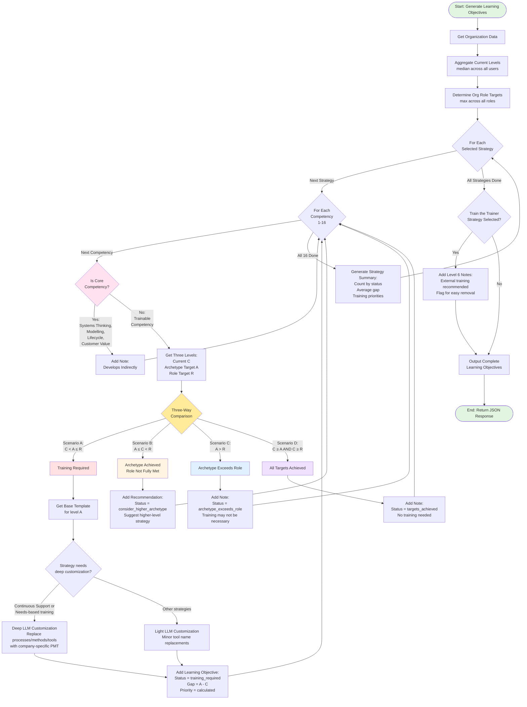

# Phase 2 Task 3: Learning Objectives Generation - Decision Flowchart

**Purpose**: Visual representation of the three-way comparison logic for learning objectives generation

**Date**: 2025-10-26

---

## Mermaid Flowchart (Renderable)



---

## Detailed Decision Tree (Text Format)

```
┌─────────────────────────────────────────────────────────────────┐
│                  START: GENERATE LEARNING OBJECTIVES             │
└────────────────────────────────┬────────────────────────────────┘
                                 │
                                 ▼
┌─────────────────────────────────────────────────────────────────┐
│              STEP 1: AGGREGATE ORGANIZATIONAL DATA               │
├─────────────────────────────────────────────────────────────────┤
│  For Each Competency (1-16):                                    │
│    • Get all user assessment results                            │
│    • Current Level = MEDIAN(user levels)                        │
│    • Role Target = MAX(all role targets in org)                 │
└────────────────────────────────┬────────────────────────────────┘
                                 │
                                 ▼
┌─────────────────────────────────────────────────────────────────┐
│                 STEP 2: LOOP THROUGH STRATEGIES                  │
└────────────────────────────────┬────────────────────────────────┘
                                 │
                    ┌────────────┴────────────┐
                    │  For Each Strategy      │
                    │  (from Phase 1)         │
                    └────────────┬────────────┘
                                 │
                                 ▼
                    ┌────────────────────────────┐
                    │  For Each Competency 1-16  │
                    └────────────┬───────────────┘
                                 │
                                 ▼
                    ┌────────────────────────────┐
                    │  Is Core Competency?       │
                    │  (Systems Thinking,        │
                    │   Modelling, Lifecycle,    │
                    │   Customer Value)          │
                    └────────┬───────────┬───────┘
                             │           │
                        YES  │           │  NO
                             │           │
                             ▼           ▼
            ┌────────────────────┐   ┌──────────────────────────┐
            │  Add Note:         │   │  Get Three Levels:       │
            │  "Develops         │   │  C = Current             │
            │   indirectly"      │   │  A = Archetype Target    │
            │  CONTINUE          │   │  R = Role Target         │
            └────────────────────┘   └──────────┬───────────────┘
                                                 │
                                                 ▼
                                   ┌─────────────────────────────┐
                                   │  THREE-WAY COMPARISON       │
                                   │  Compare C, A, R            │
                                   └──────────┬──────────────────┘
                                              │
                 ┌────────────┬───────────────┼──────────────┬────────────┐
                 │            │               │              │            │
                 ▼            ▼               ▼              ▼            ▼
         ┌───────────┐  ┌──────────┐  ┌──────────┐  ┌─────────────┐
         │ SCENARIO A│  │SCENARIO B│  │SCENARIO C│  │  SCENARIO D │
         │  C < A ≤ R│  │ A ≤ C < R│  │  A > R   │  │ C≥A & C≥R  │
         └─────┬─────┘  └────┬─────┘  └────┬─────┘  └──────┬──────┘
               │             │              │               │
               ▼             ▼              ▼               ▼
    ┌──────────────────┐ ┌────────────┐ ┌────────────┐ ┌─────────────┐
    │ Training Required│ │ Archetype  │ │ Archetype  │ │   Targets   │
    │                  │ │ Achieved,  │ │  Exceeds   │ │  Achieved   │
    │ Get template for │ │ Role Not   │ │   Role     │ │             │
    │ level A          │ │            │ │            │ │ No training │
    └────────┬─────────┘ └─────┬──────┘ └─────┬──────┘ └──────┬──────┘
             │                 │              │               │
             ▼                 │              │               │
    ┌──────────────────┐       │              │               │
    │ Customization?   │       │              │               │
    │                  │       │              │               │
    └────┬─────────┬───┘       │              │               │
         │         │           │              │               │
    Deep │         │ Light     │              │               │
         ▼         ▼           ▼              ▼               ▼
    ┌─────────┐ ┌──────┐  ┌──────────┐  ┌──────────┐  ┌──────────┐
    │   LLM   │ │ LLM  │  │  Status: │  │  Status: │  │  Status: │
    │  Heavy  │ │Light │  │ consider │  │archetype │  │ targets  │
    │Customize│ │Cust. │  │  higher  │  │ exceeds  │  │ achieved │
    └────┬────┘ └───┬──┘  └────┬─────┘  └────┬─────┘  └────┬─────┘
         │          │          │              │              │
         └──────────┴──────────┴──────────────┴──────────────┘
                                │
                                ▼
                    ┌───────────────────────┐
                    │  Add to Results for   │
                    │  Current Strategy     │
                    └───────────┬───────────┘
                                │
                                ▼
                    ┌───────────────────────┐
                    │  All 16 Competencies  │
                    │  Processed?           │
                    └────────┬──────────────┘
                             │
                        YES  │
                             ▼
                    ┌───────────────────────┐
                    │  Generate Summary:    │
                    │  • Count by status    │
                    │  • Average gap        │
                    │  • Training priorities│
                    └────────┬──────────────┘
                             │
                             ▼
                    ┌───────────────────────┐
                    │  All Strategies Done? │
                    └────────┬──────────────┘
                             │
                        YES  │
                             ▼
                    ┌───────────────────────┐
                    │  Special: Level 6?    │
                    │  (Train the Trainer)  │
                    └────┬──────────┬───────┘
                         │          │
                    YES  │          │  NO
                         ▼          ▼
            ┌────────────────┐  ┌──────────────┐
            │ Add Level 6    │  │   Output     │
            │ External Note  │  │   Results    │
            └────────┬───────┘  └──────┬───────┘
                     │                 │
                     └────────┬────────┘
                              │
                              ▼
                    ┌─────────────────────┐
                    │  RETURN JSON        │
                    │  Learning Objectives│
                    └─────────────────────┘
```

---

## Scenario Decision Matrix

| Comparison | Scenario | Status | Action |
|:----------:|:--------:|:------:|:-------|
| C < A ≤ R  | A | `training_required` | Generate customized learning objective for level A |
| A ≤ C < R  | B | `consider_higher_archetype` | Recommend selecting higher-level strategy |
| A > R      | C | `archetype_exceeds_role` | Note that training may not be necessary |
| C ≥ A AND C ≥ R | D | `targets_achieved` | No training needed |

**Legend**:
- **C** = Current competency level (from assessments, aggregated median)
- **A** = Archetype/Strategy target level
- **R** = Role maximum target level (highest across org roles)

---

## Customization Decision Flow

```
                    ┌──────────────────────────────────────┐
                    │   Learning Objective Customization   │
                    └─────────────────┬────────────────────┘
                                      │
                                      ▼
                    ┌──────────────────────────────────────┐
                    │  Is Strategy one of:                 │
                    │  • Continuous Support                │
                    │  • Needs-based Project-oriented?     │
                    └────────┬─────────────────────┬───────┘
                             │                     │
                        YES  │                     │  NO
                             │                     │
                             ▼                     ▼
            ┌────────────────────────┐    ┌──────────────────────┐
            │  DEEP CUSTOMIZATION    │    │  LIGHT CUSTOMIZATION │
            ├────────────────────────┤    ├──────────────────────┤
            │  Replace:              │    │  Replace:            │
            │  • Generic processes   │    │  • Tool names only   │
            │    with company PMT    │    │    if mentioned      │
            │  • Generic methods     │    │                      │
            │    with company PMT    │    │  Keep:               │
            │  • Generic tools       │    │  • Structure         │
            │    with company PMT    │    │  • Level indicators  │
            │                        │    │  • SMART format      │
            │  Maintain:             │    │                      │
            │  • SMART criteria      │    │                      │
            │  • Structure           │    │                      │
            │  • Level alignment     │    │                      │
            └────────────┬───────────┘    └──────────┬───────────┘
                         │                           │
                         └──────────┬────────────────┘
                                    │
                                    ▼
                         ┌──────────────────────┐
                         │  Customized Learning │
                         │  Objective Generated │
                         └──────────────────────┘
```

---

## Example Walk-Through: Decision Management Competency

### Input Data
```
Organization: AutoTech Systems GmbH
Strategy: "SE for managers"
Competency: "Decision Management" (ID: 11)

User Assessment Results:
- User1: Level 2
- User2: Level 1
- User3: Level 3
- User4: Level 2
- User5: Level 2

Roles in Organization:
- Developer (role target for Decision Mgmt: 2)
- Project Manager (role target for Decision Mgmt: 4)
- System Engineer (role target for Decision Mgmt: 4)

Strategy Target:
- "SE for managers" → Decision Management: Level 4
```

### Step-by-Step Execution

**Step 1: Aggregate Current Level**
```
User levels: [2, 1, 3, 2, 2]
Sorted: [1, 2, 2, 2, 3]
Median = 2

C (Current) = 2
```

**Step 2: Determine Org Role Target**
```
Role targets: [2, 4, 4]
Maximum = 4

R (Role Target) = 4
```

**Step 3: Get Archetype Target**
```
A (Archetype Target) = 4
(from archetypeCompetencyTargetLevels["SE for managers"]["Decision Management"])
```

**Step 4: Three-Way Comparison**
```
C = 2
A = 4
R = 4

Condition: C < A ≤ R ?
Check: 2 < 4 ≤ 4 ?
Result: TRUE → SCENARIO A (Training Required)
```

**Step 5: Get Base Template**
```
Template = learningObjectiveTemplates["Decision Management"][4]

Base text:
"Participants are able to prepare decisions for their relevant scopes
or make them themselves and document the decision-making process accordingly."
```

**Step 6: Customization Check**
```
Strategy = "SE for managers"
Is in ["Continuous support", "Needs-based project-oriented training"]? NO

Customization = LIGHT
```

**Step 7: Generate Customized Objective**
```
Input to LLM:
- Base template: [template text]
- Company PMT: "We use JIRA for decision tracking, Confluence for
  documentation, follow ISO 26262 for safety decisions"

Output:
"At the end of the four-week management module, participants will be
able to prepare complex technical decisions for their relevant scopes
using the company's decision management framework in JIRA and Confluence.
They will document the decision-making process according to ISO 26262
requirements, including rationale, alternatives considered, and trade-off
analyses, so that all safety-critical decisions are traceable and auditable."
```

**Step 8: Add to Results**
```json
{
  "competency_name": "Decision Management",
  "competency_id": 11,
  "current_level": 2,
  "archetype_target": 4,
  "role_target": 4,
  "gap": 2,
  "status": "training_required",
  "training_priority": 2.8,
  "learning_objective": "[customized text above]"
}
```

---

## Visual Legend

### Flowchart Colors

- **Green** = Start/End points
- **Red** = Scenario A (Training Required)
- **Orange** = Scenario B (Consider Higher Archetype)
- **Blue** = Scenario C (Archetype Exceeds Role)
- **Purple** = Scenario D (Targets Achieved)
- **Pink** = Core Competency Check
- **Yellow** = Three-Way Comparison Decision Point

### Status Values

| Status | Meaning | UI Display |
|--------|---------|------------|
| `training_required` | Gap exists, training needed | Red badge, high priority |
| `consider_higher_archetype` | Current archetype achieved | Orange badge, info message |
| `archetype_exceeds_role` | Strategy may be too advanced | Blue badge, warning |
| `targets_achieved` | No training needed | Green badge, success |
| `not_directly_trainable` | Core competency | Gray badge, info note |
| `external_training_recommended` | Level 6 mastery | Purple badge, external link |

---

## Configuration Impact on Flow

### Aggregation Method (Currently: Median)
```
┌──────────────┐
│ User Levels  │
│ [1,2,2,2,3]  │
└──────┬───────┘
       │
       ▼
┌──────────────┐
│ MEDIAN = 2   │  ← Current setting
├──────────────┤
│ MIN = 1      │  ← Alternative: Most conservative
│ MAX = 3      │  ← Alternative: Most optimistic
│ AVG = 2.0    │  ← Alternative: Mathematical average
└──────────────┘
```

### Role Target Strategy (Currently: Highest)
```
┌──────────────┐
│ Role Targets │
│ [2, 4, 4]    │
└──────┬───────┘
       │
       ▼
┌──────────────┐
│ HIGHEST = 4  │  ← Current setting (accommodate all)
├──────────────┤
│ MAJORITY = 4 │  ← Alternative: Most common role
│ PER_ROLE     │  ← Alternative: Separate objectives per role
└──────────────┘
```

---

## Edge Cases Handled

### Edge Case 1: Role Target = 0 (Not Relevant)
```
IF role_target == 0:
    status = "not_applicable_for_roles"
    SKIP competency (no objective generated)
```

### Edge Case 2: Very Few Users Assessed
```
IF completion_rate < 70%:
    WARNING: "Insufficient data - only X% users completed"
    RECOMMEND: Wait for more completions
```

### Edge Case 3: High Variance in User Levels
```
levels = [1, 1, 1, 6, 6]
variance = 5

IF variance > 3:
    WARNING: "Large spread in competency levels"
    NOTE: "Median may not represent organization well"
    SUGGEST: Review individual results
```

### Edge Case 4: Archetype = 6, Role = 4
```
C = 3, A = 6, R = 4

Comparison: A > R (Scenario C)
Status: "archetype_exceeds_role"
Note: "Train the Trainer strategy targets level 6, but organizational
       roles only require level 4. Consider if this is appropriate."
```

---

## Presentation Tips for Advisor

1. **Start with the spider-web chart** (Figure 4-5)
   - Visual representation of three-way comparison
   - Easier to grasp than abstract description

2. **Walk through one example** (like Decision Management above)
   - Show real numbers flowing through the logic
   - Demonstrate how each scenario is triggered

3. **Highlight decision points**
   - Core vs Trainable competency split
   - Four comparison scenarios
   - Customization depth choice

4. **Emphasize configurability**
   - Show how decisions can be changed without code modification
   - Demonstrate future-proofing

5. **Address edge cases proactively**
   - Show you've thought through boundary conditions
   - Propose handling strategies

6. **Reference Marcel's thesis**
   - Show alignment with validated research
   - Demonstrate understanding of academic foundation

---

**File End**
