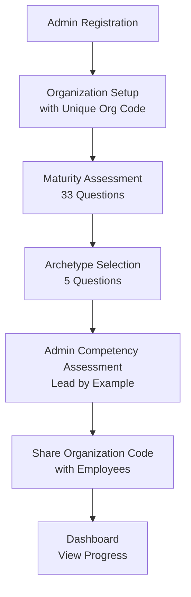
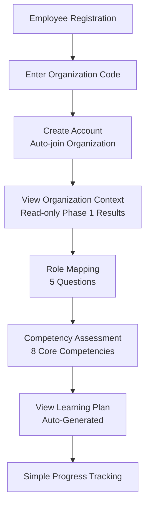

# SE-QPT MVP Architecture & Flow Design
## Simplified Implementation for Master's Thesis Project

---

## **MVP SCOPE & OBJECTIVES**

### **Primary Goal**
Develop a working prototype that demonstrates the core SE-QPT methodology within a 4-month thesis timeline, focusing on essential functionality rather than production-ready features.

### **MVP Success Criteria**
- ✅ Admin can complete organizational maturity assessment
- ✅ Admin can select qualification archetypes  
- ✅ Employees can complete competency assessments
- ✅ System generates basic learning plans
- ✅ Demonstrates value over manual qualification planning
- ✅ Provides foundation for thesis validation

---

## **1. SIMPLIFIED USER ROLES & PERMISSIONS**

### **1.1 Two-Tier Role Structure**

### **6.5 Basic Learning Plan Generation**

```typescript
// Template-based learning objectives
const generateLearningPlan = (competencyGaps, archetype, roleCluster) => {
  const templates = {
    'SE_for_Managers': [
      'Understand Systems Engineering fundamentals',
      'Learn SE process integration',
      'Develop SE leadership skills'
    ],
    'Common_Understanding': [
      'Gain SE awareness across organization',
      'Understand SE terminology and concepts',
      'Learn basic SE tools and methods'
    ]
    // ... other templates
  };
  
  let objectives = templates[archetype] || [];
  
  // Simple customization based on competency gaps
  competencyGaps.forEach(gap => {
    if (gap.severity > 2) {
      objectives.push(`Improve ${gap.competency} skills`);
    }
  });
  
  return {
    userId,
    objectives,
    recommendedModules: getBasicModules(archetype),
    estimatedDuration: calculateDuration(objectives.length)
  };
};
```typescript
enum UserRole {
  ORGANIZATIONAL_ADMIN = 'admin',
  EMPLOYEE = 'employee'
}

interface BasicPermissions {
  canManageOrganization: boolean;
  canViewOrgResults: boolean;
  canInviteUsers: boolean;
  canViewAllAssessments: boolean;
  canTakeAssessment: boolean;
  canViewOwnResults: boolean;
}
```

### **1.2 Simplified Permission Matrix**

| Permission | Org Admin | Employee |
|------------|-----------|----------|
| **Organizational Setup** |
| Complete Maturity Assessment | ✅ | ❌ |
| Select Qualification Archetype | ✅ | ❌ |
| View Organization Results | ✅ | ✅ (Read-only) |
| View Organization Code | ✅ | ❌ |
| **User Management** |
| View All User Results | ✅ | ❌ |
| View Employee List | ✅ | ❌ |
| **Individual Assessment** |
| Take Competency Assessment | ✅ (Required) | ✅ (Required) |
| Take Role Mapping Assessment | ✅ | ✅ |
| View Own Results | ✅ | ✅ |
| View Learning Plan | ✅ | ✅ |

---

## **2. MVP DATA MODEL (SIMPLIFIED)**

### **2.1 Core Entities (6 Tables Only)**

```typescript
// Core Tables for MVP
interface Organization {
  id: string;
  name: string;
  organizationCode: string; // Unique 6-8 character code
  size: string; // 'small' | 'medium' | 'large'
  maturityScore?: number;
  selectedArchetype?: string;
  createdAt: Date;
}

interface User {
  id: string;
  email: string;
  firstName: string;
  lastName: string;
  role: UserRole;
  organizationId: string;
  joinedViaCode: string; // Organization code used to join
  createdAt: Date;
}

interface MaturityAssessment {
  id: string;
  organizationId: string;
  scopeScore: number;
  processScore: number;
  overallMaturity: string;
  responses: JSON; // Store as JSON for simplicity
  completedAt: Date;
}

interface CompetencyAssessment {
  id: string;
  userId: string;
  competencyScores: JSON; // Simplified JSON storage
  roleCluster: string;
  completedAt: Date;
}

interface LearningPlan {
  id: string;
  userId: string;
  objectives: JSON; // Pre-defined templates
  recommendedModules: JSON;
  createdAt: Date;
}

interface RoleMapping {
  id: string;
  userId: string;
  assignedRoleCluster: string;
  confidence: number;
  mappingData: JSON;
  createdAt: Date;
}
```

### **2.2 Simplified Relationships**

```
Organization (1) → (many) Users
Organization (1) → (1) MaturityAssessment
User (1) → (1) CompetencyAssessment
User (1) → (1) LearningPlan
User (1) → (1) RoleMapping
```

---

## **3. MVP USER FLOWS**

### **3.1 Admin Setup Flow (Simplified)**



**Simplified Admin Steps:**
1. **Registration**: Basic org details (name, size) → System generates unique org code
2. **Maturity Assessment**: 33-question assessment with auto-scoring
3. **Archetype Selection**: 5-question strategy selection with recommendation
4. **Admin Competency Assessment**: Complete own competency assessment (lead by example)
5. **Share Organization Code**: Provide employees with org code for self-registration
6. **Dashboard**: Basic view of employee progress + own learning plan

### **3.2 Employee Flow (Self-Registration)**



**Simplified Employee Steps:**
1. **Self-Registration**: Register with email/password + organization code
2. **Auto-Join**: Automatically becomes part of organization
3. **Organization Context**: View organization's maturity level and selected archetype (read-only)
4. **Role Mapping**: 5 questions to determine role cluster
5. **Competency Assessment**: Simplified to 8 core SE competencies
6. **Learning Plan**: Auto-generated based on gaps, no approval needed
7. **Progress**: Simple checklist tracking

---

## **4. SIMPLIFIED API ARCHITECTURE**

### **4.1 Core API Endpoints (13 Total)**

```typescript
// Authentication (4 endpoints)
POST   /api/auth/login
POST   /api/auth/register-admin       // Admin creates organization
POST   /api/auth/register-employee   // Employee joins with org code
GET    /api/auth/me

// Organization Management (3 endpoints)
POST   /api/organization/setup
GET    /api/organization/dashboard
PUT    /api/organization/archetype

// Organization Code (2 endpoints)
GET    /api/organization/verify-code/:code
GET    /api/organization/code        // Admin retrieves their org code

// Assessments (4 endpoints)
POST   /api/assessments/maturity
POST   /api/assessments/competency
GET    /api/assessments/results/:userId
GET    /api/assessments/organization-summary

// Learning Plans (2 endpoints - removed user management)
GET    /api/learning-plan/:userId
POST   /api/learning-plan/generate
```

### **4.2 Simplified Authentication**

```typescript
// Basic JWT Implementation
interface AuthToken {
  userId: string;
  organizationId: string;
  role: UserRole;
  expiresAt: Date;
}

// Simple middleware
const authenticate = (req, res, next) => {
  const token = req.headers.authorization?.split(' ')[1];
  if (!token) return res.status(401).json({ error: 'Token required' });
  
  try {
    const decoded = jwt.verify(token, process.env.JWT_SECRET);
    req.user = decoded;
    next();
  } catch (error) {
    return res.status(403).json({ error: 'Invalid token' });
  }
};
```

---

## **5. MVP FRONTEND STRUCTURE**

### **5.1 Simplified Tech Stack**

```typescript
// Frontend Technologies
- React (with hooks, no Redux)
- React Router (basic routing)
- Context API (simple state management)
- Tailwind CSS (utility-first styling)
- Axios (API calls)
- Local Storage (simple session persistence)
```

### **5.2 Component Structure**

```
src/
├── components/
│   ├── common/
│   │   ├── Header.jsx
│   │   ├── Layout.jsx
│   │   └── ProtectedRoute.jsx
│   ├── assessments/
│   │   ├── MaturityAssessment.jsx
│   │   ├── CompetencyAssessment.jsx
│   │   └── RoleMapping.jsx
│   ├── admin/
│   │   ├── Dashboard.jsx
│   │   ├── OrganizationSetup.jsx
│   │   └── OrganizationCode.jsx
│   ├── employee/
│   │   ├── Dashboard.jsx
│   │   ├── OrganizationContextView.jsx  // New: Read-only Phase 1 view
│   │   ├── LearningPlan.jsx
│   │   └── Progress.jsx
│   └── shared/
│       ├── Dashboard.jsx              // Shared dashboard logic
│       ├── LearningPlan.jsx          // Used by both admin & employees
│       └── Progress.jsx              // Used by both admin & employees
├── context/
│   ├── AuthContext.js
│   └── OrganizationContext.js
├── hooks/
│   ├── useAuth.js
│   └── useAssessment.js
└── services/
    └── api.js
```

### **5.3 Simple State Management**

```typescript
// AuthContext (No Redux needed)
const AuthContext = createContext();

export const AuthProvider = ({ children }) => {
  const [user, setUser] = useState(null);
  const [loading, setLoading] = useState(true);
  
  useEffect(() => {
    const token = localStorage.getItem('token');
    if (token) {
      // Verify token and set user
      verifyToken(token).then(setUser);
    }
    setLoading(false);
  }, []);
  
  return (
    <AuthContext.Provider value={{ user, setUser, loading }}>
      {children}
    </AuthContext.Provider>
  );
};
```

### **5.4 MVP Route Structure**

```typescript
// Simplified Routing
const AppRoutes = () => (
  <Routes>
    {/* Public Routes */}
    <Route path="/login" element={<Login />} />
    <Route path="/register/admin" element={<AdminRegister />} />
    <Route path="/register/employee" element={<EmployeeRegister />} />
    
    {/* Protected Routes */}
    <Route path="/" element={<ProtectedRoute />}>
      <Route index element={<Dashboard />} />
      
      {/* Admin Routes */}
      <Route path="admin/setup" element={<OrganizationSetup />} />
      <Route path="admin/maturity" element={<MaturityAssessment />} />
      <Route path="admin/archetype" element={<ArchetypeSelection />} />
      <Route path="admin/users" element={<UserOverview />} />
      <Route path="admin/organization-code" element={<OrganizationCode />} />
      
      {/* Shared Assessment Routes (Admin + Employee) */}
      <Route path="assessment/role" element={<RoleMapping />} />
      <Route path="assessment/competency" element={<CompetencyAssessment />} />
      
      {/* Employee Routes */}
      <Route path="organization/context" element={<OrganizationContextView />} />
      <Route path="learning-plan" element={<LearningPlan />} />
      <Route path="progress" element={<Progress />} />
    </Route>
  </Routes>
);
```

---

## **6. SIMPLIFIED BUSINESS LOGIC**

### **6.1 Maturity Scoring (Simplified)**

```typescript
// Basic maturity calculation
const calculateMaturity = (responses) => {
  const scopeQuestions = responses.slice(0, 15);
  const processQuestions = responses.slice(15, 33);
  
  const scopeScore = scopeQuestions.reduce((sum, q) => sum + q.score, 0) / 15;
  const processScore = processQuestions.reduce((sum, q) => sum + q.score, 0) / 18;
  
  const overallMaturity = Math.sqrt((scopeScore ** 2 + processScore ** 2) / 2);
  
  return {
    scopeScore,
    processScore,
    overallMaturity,
    level: getMaturityLevel(overallMaturity)
  };
};

const getMaturityLevel = (score) => {
  if (score <= 1.5) return 'Initial';
  if (score <= 2.5) return 'Developing';
  if (score <= 3.5) return 'Defined';
  if (score <= 4.0) return 'Managed';
  return 'Optimized';
};
```

### **6.2 Archetype Selection (Basic Decision Tree)**

```typescript
// Simplified archetype selection
const selectArchetype = (maturityResult, preferences) => {
  const { processScore, scopeScore } = maturityResult;
  
  if (processScore <= 1.5) {
    // Low maturity - dual selection needed
    const primary = 'SE_for_Managers';
    let secondary;
    
    switch (preferences.goal) {
      case 'apply_se':
        secondary = 'Orientation_Pilot_Project';
        break;
      case 'basic_understanding':
        secondary = 'Common_Understanding';
        break;
      case 'expert_training':
        secondary = 'Certification';
        break;
      default:
        secondary = 'Common_Understanding';
    }
    
    return { primary, secondary, customizationLevel: 'low' };
  } else {
    // Higher maturity - single selection
    const archetype = scopeScore >= 3.0 ? 'Continuous_Support' : 'Needs_Based_Training';
    return { primary: archetype, customizationLevel: 'high' };
  }
};
```

### **6.4 Organization Code System**

```typescript
// Organization code generation and validation
const generateOrgCode = (organizationName) => {
  // Generate 6-character code: 3 letters from org name + 3 random chars
  const namePrefix = organizationName
    .replace(/[^a-zA-Z]/g, '')
    .substring(0, 3)
    .toUpperCase();
  
  const randomSuffix = Math.random().toString(36).substring(2, 5).toUpperCase();
  
  return `${namePrefix}${randomSuffix}`;
};

const validateOrgCode = async (code) => {
  // Check if organization code exists and is active
  const organization = await Organization.findOne({ 
    organizationCode: code.toUpperCase() 
  });
  
  if (!organization) {
    throw new Error('Invalid organization code');
  }
  
  return organization;
};

// Employee registration with organization code
const registerEmployee = async (userData, orgCode) => {
  // Validate organization code
  const organization = await validateOrgCode(orgCode);
  
  // Create user account
  const user = await User.create({
    ...userData,
    organizationId: organization.id,
    joinedViaCode: orgCode,
    role: 'employee'
  });
  
  return user;
};

// Organization context view for employees (read-only)
const getOrganizationContext = async (userId) => {
  const user = await User.findById(userId).populate('organization');
  const maturityAssessment = await MaturityAssessment.findOne({
    organizationId: user.organizationId
  });
  
  return {
    organizationName: user.organization.name,
    maturityLevel: maturityAssessment?.overallMaturity || 'Not Assessed',
    maturityScore: maturityAssessment?.overallMaturity || 0,
    selectedArchetype: user.organization.selectedArchetype || 'Not Selected',
    employeeCount: await User.countDocuments({ organizationId: user.organizationId })
  };
};
```

```typescript
// Template-based learning objectives
const generateLearningPlan = (competencyGaps, archetype, roleCluster) => {
  const templates = {
    'SE_for_Managers': [
      'Understand Systems Engineering fundamentals',
      'Learn SE process integration',
      'Develop SE leadership skills'
    ],
    'Common_Understanding': [
      'Gain SE awareness across organization',
      'Understand SE terminology and concepts',
      'Learn basic SE tools and methods'
    ]
    // ... other templates
  };
  
  let objectives = templates[archetype] || [];
  
  // Simple customization based on competency gaps
  competencyGaps.forEach(gap => {
    if (gap.severity > 2) {
      objectives.push(`Improve ${gap.competency} skills`);
    }
  });
  
  return {
    userId,
    objectives,
    recommendedModules: getBasicModules(archetype),
    estimatedDuration: calculateDuration(objectives.length)
  };
};
```

---

## **7. MVP IMPLEMENTATION TIMELINE**

### **Week 1-3: Backend Foundation**
```
✅ Database setup (SQLite for development)
✅ Basic Express server with authentication
✅ Organization code generation and validation system
✅ Core API endpoints (authentication + organization)
✅ Simple assessment scoring logic
```

### **Week 4-6: Assessment Engine**
```
✅ Maturity assessment questionnaire
✅ Competency assessment (8 competencies)
✅ Basic archetype selection logic
✅ Role mapping functionality
```

### **Week 7-10: Frontend Development**
```
✅ React app setup with routing
✅ Admin dashboard and setup flows
✅ Assessment interfaces
✅ Results display components
✅ Basic responsive design
```

### **Week 11-12: Learning Plan Generation**
```
✅ Template-based learning objectives
✅ Basic customization logic
✅ Simple progress tracking
✅ Learning plan display
```

### **Week 13-14: Integration & Testing**
```
✅ End-to-end user flow testing
✅ Bug fixes and refinements
✅ Basic documentation
✅ Demo preparation
```

---

## **8. TECHNOLOGY DECISIONS FOR MVP**

### **8.1 Backend Stack**

```typescript
// Production-ready but simple
- Node.js + Express
- SQLite (development) / PostgreSQL (production)
- JWT for authentication
- Bcrypt for password hashing
- Basic input validation with Joi
- Simple error handling middleware
```

### **8.2 Frontend Stack**

```typescript
// Modern but not over-engineered
- React 18 with hooks
- React Router v6
- Tailwind CSS for styling
- Axios for API calls
- React Hook Form for forms
- Local storage for session persistence
```

### **8.3 Development Tools**

```typescript
// Essential development setup
- Vite (fast development server)
- ESLint + Prettier (code quality)
- Jest (basic testing)
- Postman (API testing)
- Git (version control)
```

---

## **9. MVP FEATURE LIMITATIONS**

### **9.1 Intentionally Excluded Features**

```
❌ Advanced RAG LLM integration (use simple templates)
❌ Complex permission systems (admin vs employee only)
❌ Email notifications/invitations (use organization codes)
❌ Advanced analytics dashboards (basic metrics only)
❌ Multi-organization support (single org per instance)
❌ Mobile app or PWA features
❌ Advanced security measures (basic JWT only)
❌ Data export/import functionality
❌ Real-time notifications
❌ Complex validation and error handling
❌ User invitation management system
```

### **9.2 MVP Workarounds**

```
✅ Instead of email invitations → Organization code sharing
✅ Instead of advanced analytics → Basic progress counters
✅ Instead of complex RAG → Template-based customization
✅ Instead of role management → Simple admin/employee roles
✅ Instead of approval workflows → Auto-generated plans
✅ Instead of mobile responsive → Desktop-first design
✅ Instead of user invitation system → Self-registration with org codes
```

---

## **10. TESTING & VALIDATION STRATEGY**

### **10.1 MVP Testing Approach**

```typescript
// Testing Priorities for MVP
1. Core User Flows (Manual Testing)
   - Admin setup and maturity assessment
   - Employee onboarding and competency assessment
   - Learning plan generation and display

2. API Testing (Postman)
   - Authentication endpoints
   - Assessment submission and scoring
   - Data retrieval and persistence

3. Basic Unit Tests (Limited Scope)
   - Maturity scoring algorithm
   - Archetype selection logic
   - Role mapping functionality

4. User Acceptance Testing
   - 5-10 test users from target audience
   - Feedback on usability and value
   - Validation of thesis hypothesis
```

### **10.2 Success Metrics**

```
✅ Technical Metrics:
- All core user flows complete successfully
- Assessment scoring produces consistent results
- Learning plans generate appropriate recommendations

✅ User Experience Metrics:
- Users can complete full flow in <30 minutes
- Assessment results are perceived as accurate
- Learning plans are viewed as valuable

✅ Thesis Validation Metrics:
- Demonstrates improvement over manual planning
- Shows integration of multiple methodologies
- Provides data for thesis conclusions
```

---

## **11. RISK MITIGATION**

### **11.1 Technical Risks**

| Risk | Probability | Impact | Mitigation |
|------|-------------|--------|------------|
| Complex assessment logic | Medium | High | Pre-built scoring templates |
| Database design issues | Low | Medium | Simple schema, easy to modify |
| Frontend complexity | Medium | Medium | Focus on functionality over aesthetics |
| API integration problems | Low | High | Thorough testing of core endpoints |

### **11.2 Timeline Risks**

| Risk | Probability | Impact | Mitigation |
|------|-------------|--------|------------|
| Feature creep | High | High | Strict MVP scope adherence |
| Technical roadblocks | Medium | High | Simple tech stack, proven solutions |
| Testing delays | Medium | Medium | Continuous testing throughout development |
| Integration issues | Low | High | Regular end-to-end testing |

---

## **12. POST-MVP ENHANCEMENT PATH**

### **12.1 Immediate Improvements (Post-Thesis)**
```
- Advanced RAG LLM integration
- Email notification system
- Enhanced UI/UX design
- Mobile responsiveness
- Basic analytics dashboard
```

### **12.2 Future Enhancements**
```
- Multi-organization support
- Advanced security features
- Learning content management
- Integration with external LMS
- Advanced reporting and analytics
```

---

## **13. MVP VALIDATION CHECKLIST**

### **✅ Architecture Validation**

| Aspect | Requirement | MVP Status | ✓ |
|--------|-------------|------------|---|
| **Scope** | Achievable in 4 months | ✅ Simplified to core features | ✓ |
| **Complexity** | Appropriate for thesis | ✅ Reduced from production-level | ✓ |
| **Value** | Demonstrates thesis objectives | ✅ All core objectives covered | ✓ |
| **Technical** | Feasible with available skills | ✅ Standard web technologies | ✓ |
| **User Experience** | Complete user flows | ✅ End-to-end functionality | ✓ |
| **Data Model** | Simple but sufficient | ✅ 6 tables vs 15+ originally | ✓ |
| **API Design** | Essential endpoints only | ✅ 15 endpoints vs 40+ originally | ✓ |
| **Frontend** | Functional over fancy | ✅ React with basic styling | ✓ |

### **✅ Thesis Alignment Validation**

| Thesis Objective | MVP Coverage | Validation Method | ✓ |
|-----------------|--------------|-------------------|---|
| Maturity-based planning | ✅ Core maturity assessment + employee context view | Working algorithm + user testing | ✓ |
| Competency integration | ✅ All users (admin + employees) take competency assessment | Integration with existing frameworks | ✓ |
| Role mapping | ✅ Basic role cluster assignment for all users | Accuracy testing with real roles | ✓ |
| Archetype selection | ✅ Decision tree implementation + transparency | Logic validation with test cases | ✓ |
| Learning objectives | ✅ Template-based generation for all users | Comparison with manual planning | ✓ |
| Web platform | ✅ Working prototype with simplified user flows | End-to-end user testing | ✓ |

### **✅ Implementation Feasibility**

| Technical Area | Complexity | Required Skills | Available | ✓ |
|----------------|------------|----------------|-----------|---|
| Backend Development | Medium | Node.js, Express, SQL | ✅ Standard | ✓ |
| Frontend Development | Medium | React, JavaScript, CSS | ✅ Standard | ✓ |
| Database Design | Low | Basic SQL, relationships | ✅ Simplified | ✓ |
| Authentication | Low | JWT, basic security | ✅ Standard | ✓ |
| Assessment Logic | Medium | Algorithms, scoring | ✅ Mathematical | ✓ |
| Testing | Low | Manual + basic automated | ✅ Essential only | ✓ |

### **✅ Value Demonstration**

| Stakeholder | Value Delivered | Evidence | ✓ |
|-------------|----------------|----------|---|
| **Thesis Committee** | Working prototype demonstrating research | Complete user flows + documentation | ✓ |
| **Organizations** | Automated SE qualification planning | Faster planning vs manual methods | ✓ |
| **SE Community** | Integration of existing methodologies | Novel combination of proven approaches | ✓ |
| **Future Development** | Solid foundation for enhancement | Modular, extensible architecture | ✓ |

---

## **FINAL VALIDATION: MVP READINESS ✅**

### **Scope Assessment: APPROPRIATE**
- **Complexity**: Reduced from production-level to thesis-appropriate
- **Timeline**: 14 weeks achievable vs. original 24+ weeks
- **Features**: Core functionality preserved, complexity removed
- **Value**: All thesis objectives demonstrable

### **Technical Assessment: FEASIBLE**
- **Architecture**: Simplified but complete
- **Technology**: Standard, well-documented tools
- **Database**: Simple 6-table design vs. complex 15+ tables
- **API**: Essential 15 endpoints vs. comprehensive 40+ endpoints

### **Research Assessment: VALID**
- **Problem Solving**: Addresses core SE qualification challenges
- **Innovation**: Demonstrates integration of multiple methodologies
- **Validation**: Provides sufficient data for thesis conclusions
- **Contribution**: Advances SE-QPT concept with working prototype

### **Implementation Assessment: READY**
- **Development Plan**: Clear 14-week timeline
- **Risk Mitigation**: Identified risks with mitigation strategies
- **Testing Strategy**: Focused on core functionality validation
- **Success Criteria**: Measurable outcomes defined

**✅ VERDICT: MVP ARCHITECTURE APPROVED FOR THESIS IMPLEMENTATION**

This simplified architecture maintains the core value proposition while being realistically achievable within the master's thesis timeline and scope constraints.