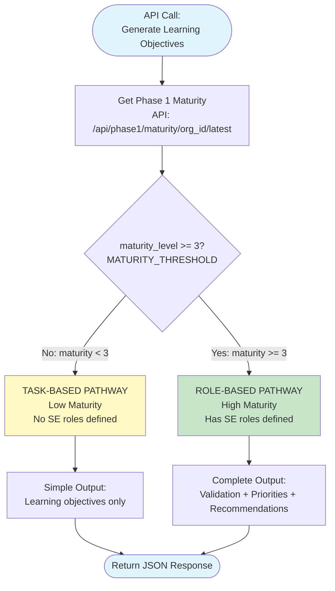
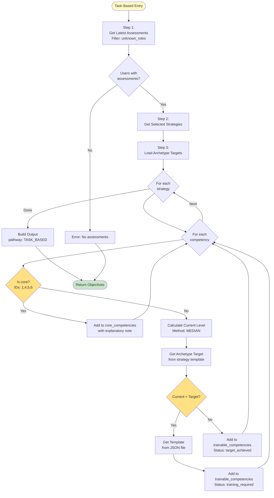
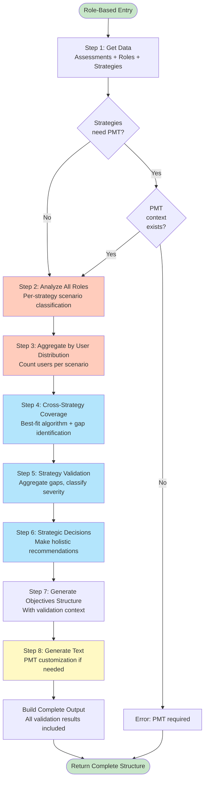
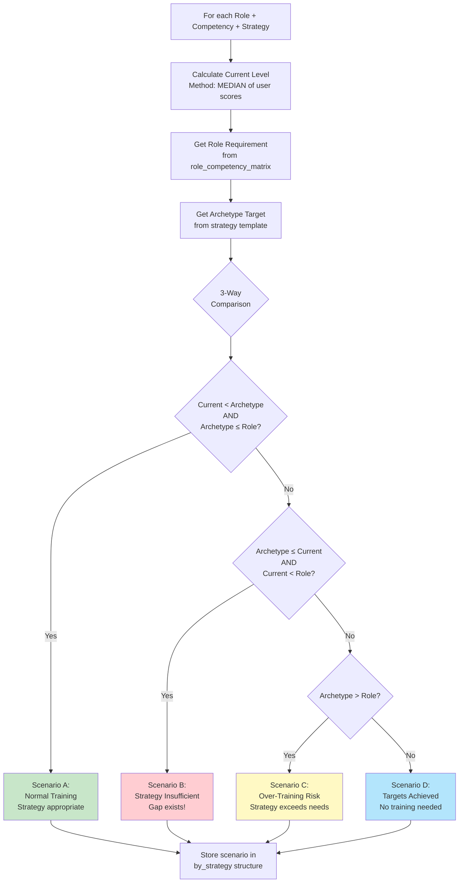
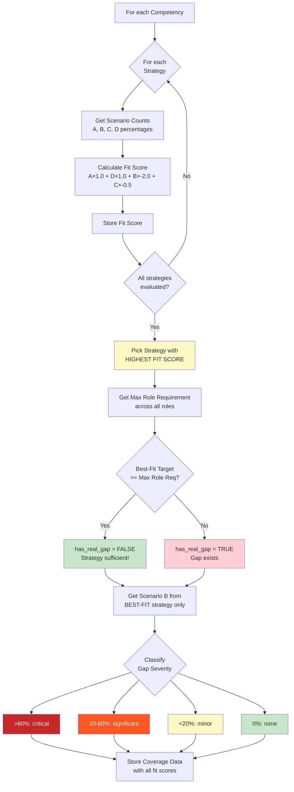
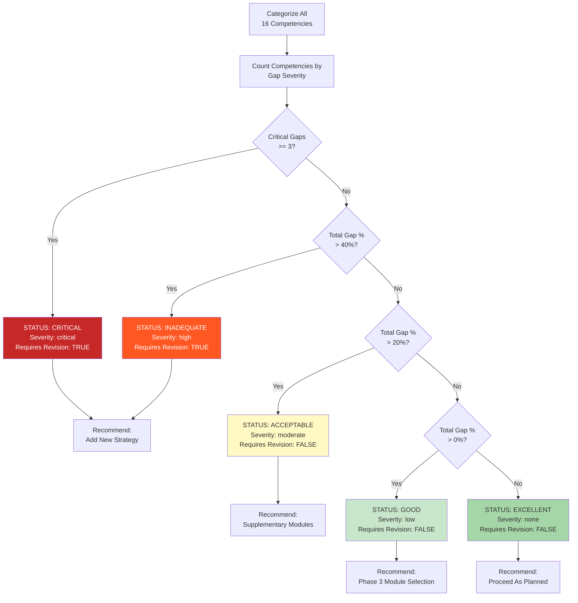

# Learning Objectives Generation - Algorithm Summary

---

## Quick Overview

This system generates customized learning objectives for organizations based on:
- **Competency assessment results** (what users currently know)
- **Selected training strategies** (what organization chose in Phase 1)
- **Role requirements** (what each role needs - if organization has roles)
- **Company context** (PMT - Processes, Methods, Tools)

**Two different pathways** based on organization maturity:

| Pathway | When Used | Complexity | Steps |
|---------|-----------|------------|-------|
| **Task-Based** | Low maturity (level 1-2) | Simple | 5 steps |
| **Role-Based** | High maturity (level 3-5) | Complex | 8 steps |

---

## How Pathway is Determined



**Example:**
```javascript
Organization 28: maturity_level = 4
Decision: 4 >= 3 → Use ROLE-BASED pathway
```

---

## TASK-BASED PATHWAY (Simple)

**For organizations without defined SE roles**

### Complete Flowchart



### Step-by-Step Process

#### **Step 1: Get Latest Assessments**
**What it does:** Fetch the most recent competency assessment for each user

**Example:**
```json
{
  "org_id": 28,
  "users": [
    {"user_id": 101, "role": "unknown_roles"},
    {"user_id": 102, "role": "unknown_roles"},
    {"user_id": 103, "role": "unknown_roles"}
  ]
}
```

---

#### **Step 2: Get Selected Strategies**
**What it does:** Retrieve which training strategies the organization selected in Phase 1

**Example:**
```json
{
  "selected_strategies": [
    {
      "name": "Common basic understanding",
      "description": "Foundational SE knowledge for all team members"
    }
  ]
}
```

---

#### **Step 3: Calculate Current Levels**
**What it does:** For each competency, calculate the organization's current level using MEDIAN

**Why median?** Robust to outliers - if one user scored 0 and others scored 2, median gives 2

**Example for Decision Management:**
```
User 101: Level 0
User 102: Level 1
User 103: Level 2

Current Level = median([0, 1, 2]) = 1
```

---

#### **Step 4: Compare Current vs Target**
**What it does:** 2-way comparison - Current Level vs Strategy Target

**Example:**
```
Competency: Decision Management
Current Level: 1
Strategy Target: 2 (from "Common basic understanding")

Gap = 2 - 1 = 1 → Training needed!
```

---

#### **Step 5: Generate Objectives**
**What it does:** For each gap, get the learning objective template

**Example Output:**
```json
{
  "competency_id": 11,
  "competency_name": "Decision Management",
  "current_level": 1,
  "target_level": 2,
  "gap": 1,
  "status": "training_required",
  "learning_objective": "Participants learn about decision support methods such as trade studies and can apply simple decision matrices."
}
```

**Note:** No customization - uses template as-is

---

### Task-Based Complete Example

**Input:**
- Organization: 28
- Users: 3 (all with role="unknown_roles")
- Strategy: "Common basic understanding"
- Competency: Decision Management

**Processing:**
1. Scores: [0, 1, 2]
2. Current: median = 1
3. Target: 2
4. Gap: 1
5. Template: "Participants learn about decision support methods..."

**Output:**
```json
{
  "pathway": "TASK_BASED",
  "learning_objectives_by_strategy": {
    "Common basic understanding": {
      "trainable_competencies": [
        {
          "competency_name": "Decision Management",
          "current_level": 1,
          "target_level": 2,
          "gap": 1,
          "learning_objective": "Participants learn about decision support methods such as trade studies and can apply simple decision matrices."
        }
      ]
    }
  }
}
```

---

## ROLE-BASED PATHWAY (Complex)

**For organizations with defined SE roles**

### Complete Flowchart



### The 8 Steps Overview

```
1. Get Data (assessments + roles + strategies)
   ↓
2. Analyze Each Role (classify scenarios per competency)
   ↓
3. Aggregate by User Distribution (count users in scenarios)
   ↓
4. Cross-Strategy Coverage (find best-fit strategy)
   ↓
5. Strategy Validation (check if strategies adequate)
   ↓
6. Strategic Decisions (make recommendations)
   ↓
7. Generate Objectives Structure
   ↓
8. Generate Learning Objective Text (with PMT if needed)
```

---

### Step 1: Get Data

**What it does:** Fetch all required data

**Example:**
```json
{
  "user_assessments": [
    {"user_id": 201, "roles": [1, 2], "scores": {"11": 2, "7": 3}},
    {"user_id": 202, "roles": [1], "scores": {"11": 2, "7": 4}},
    {"user_id": 203, "roles": [2], "scores": {"11": 3, "7": 3}}
  ],
  "organization_roles": [
    {"id": 1, "name": "SE Manager"},
    {"id": 2, "name": "Systems Engineer"}
  ],
  "selected_strategies": [
    {"name": "SE for managers"},
    {"name": "Needs-based project-oriented training"}
  ]
}
```

---

### Step 2: Analyze Each Role

**What it does:** For each role, calculate current level and classify into scenarios

#### Scenario Classification Flowchart



**The 4 Scenarios:**

| Scenario | Condition | Meaning |
|----------|-----------|---------|
| **A** | Current < Archetype ≤ Role | Normal - need training |
| **B** | Archetype ≤ Current < Role | Gap - strategy insufficient |
| **C** | Archetype > Role | Warning - over-training |
| **D** | Current ≥ Both | Good - targets met |

**Example for Decision Management:**

**Role: SE Manager (2 users)**
- User 201: Level 2
- User 202: Level 4
- **Current Level** (median): 3

**Strategy: "SE for managers"**
- Archetype Target: 4
- Role Requirement: 6
- Classification: Current (3) < Archetype (4) ≤ Role (6) → **Scenario A**

**Output:**
```json
{
  "role_id": 1,
  "role_name": "SE Manager",
  "competency_11": {
    "current_level": 3,
    "by_strategy": {
      "SE for managers": {
        "archetype_target": 4,
        "role_requirement": 6,
        "scenario": "A"
      }
    }
  }
}
```

---

### Step 3: Aggregate by User Distribution

**What it does:** Count how many users fall into each scenario

**Example:**
```
SE Manager (2 users): Scenario A
Systems Engineer (3 users): Scenario D
```

**Aggregated Result:**
```json
{
  "competency_11": {
    "by_strategy": {
      "SE for managers": {
        "total_users": 5,
        "scenario_A_count": 2,
        "scenario_D_count": 3,
        "scenario_A_percentage": 40.0,
        "scenario_D_percentage": 60.0,
        "users_by_scenario": {
          "A": [201, 202],
          "D": [203, 204, 205]
        }
      }
    }
  }
}
```

---

### Step 4: Cross-Strategy Coverage (CRITICAL!)

**What it does:** Find which strategy BEST serves the organization (not just highest target!)

#### Best-Fit Algorithm Flowchart



**Best-Fit Formula:**
```
Fit Score = (A% × 1.0) + (D% × 1.0) + (B% × -2.0) + (C% × -0.5)
```

**Why this matters:**

**OLD approach (wrong):**
- Pick strategy with highest target
- Problem: May over-train 90% of users!

**NEW approach (correct):**
- Pick strategy with best fit score
- Balances: serving majority + minimal gaps + avoid over-training

**Example:**

3 strategies available for Decision Management:

| Strategy | Target | Scenario A | Scenario B | Scenario C | Fit Score | Result |
|----------|--------|------------|------------|------------|-----------|--------|
| SE for managers | 2 | 25% | 75% | 0% | -1.25 | Too low |
| Needs-based | 4 | 70% | 20% | 10% | **+0.25** | **BEST!** |
| Advanced training | 6 | 12.5% | 0% | 87.5% | -0.31 | Over-trains |

**Decision:** Pick "Needs-based" even though it doesn't reach max requirement (6)
- Why? Serves 70% perfectly, only 20% have gaps
- "Advanced training" would over-train 87.5% of users!

**Output:**
```json
{
  "competency_11": {
    "best_fit_strategy": "Needs-based project-oriented training",
    "best_fit_score": 0.25,
    "has_real_gap": true,
    "scenario_B_count": 8,
    "scenario_B_percentage": 20.0,
    "gap_severity": "significant"
  }
}
```

---

### Step 5: Strategy Validation

**What it does:** Check if selected strategies are adequate across ALL competencies

#### Validation Decision Tree



**Gap Severity Classification:**
- **Critical:** > 60% of users have gaps
- **Significant:** 20-60% of users have gaps
- **Minor:** < 20% of users have gaps

**Example:**

Out of 16 competencies:
- Competency 3: 5% gap (minor)
- Competency 11: 25% gap (significant)
- Other 14: 0% gap (well-covered)

**Total Gap %** = 2/16 × 100 = 12.5%

**Validation Result:**
```json
{
  "status": "GOOD",
  "gap_percentage": 12.5,
  "competency_breakdown": {
    "critical_gaps": [],
    "significant_gaps": [11],
    "minor_gaps": [3],
    "well_covered": [2, 7, 8, 9, 10, 12, 13, 14, 15, 16]
  },
  "strategies_adequate": true,
  "requires_strategy_revision": false,
  "recommendation_level": "PROCEED_AS_PLANNED"
}
```

**Validation Thresholds:**

| Gap % | Status | Action Required |
|-------|--------|----------------|
| 0% | EXCELLENT | None - proceed |
| 0-20% | GOOD | Phase 3 module selection |
| 20-40% | ACCEPTABLE | Supplementary modules needed |
| >40% | INADEQUATE | Must add new strategy |

---

### Step 6: Strategic Decisions

**What it does:** Make holistic recommendations based on validation

**Example (GOOD status):**
```json
{
  "overall_action": "PROCEED_AS_PLANNED",
  "overall_message": "Selected strategies are well-aligned with organizational needs",
  "supplementary_module_guidance": [
    {
      "competency_id": 11,
      "competency_name": "Decision Management",
      "guidance": "Select advanced modules during Phase 3 to cover Level 6 requirements",
      "affected_users": 8
    }
  ],
  "suggested_strategy_additions": []
}
```

**Example (INADEQUATE status):**
```json
{
  "overall_action": "REVISE_STRATEGY_SELECTION",
  "overall_message": "Significant gaps detected in 8 competencies. Recommend adding 'Continuous support' strategy.",
  "suggested_strategy_additions": [
    {
      "strategy_name": "Continuous support",
      "rationale": "Covers gaps in Verification, Validation, and Testing competencies",
      "competencies_addressed": [15, 16, 17],
      "requires_pmt": true
    }
  ]
}
```

---

### Step 7: Generate Objectives Structure

**What it does:** Create the output structure with all validation context

**Example:**
```json
{
  "SE for managers": {
    "strategy_name": "SE for managers",
    "priority": "PRIMARY",
    "trainable_competencies": [
      {
        "competency_id": 11,
        "competency_name": "Decision Management",
        "current_level": 3,
        "target_level": 4,
        "max_role_requirement": 6,
        "gap": 1,
        "status": "training_required",
        "scenario_distribution": {"A": 40.0, "D": 60.0},
        "gap_severity": "none",
        "users_requiring_training": 2
      }
    ]
  }
}
```

---

### Step 8: Generate Learning Objective Text

**What it does:** Create actual SMART learning objectives with PMT customization (if needed)

**Two Approaches:**

#### Approach 1: Template As-Is (No Customization)
**For:** SE for managers, Common basic understanding, etc.

**Example:**
```json
{
  "competency_id": 11,
  "learning_objective": "Participants are able to prepare decisions for their relevant scopes or make them themselves and document the decision-making process accordingly."
}
```

#### Approach 2: Deep Customization with LLM
**For:** Needs-based project-oriented training, Continuous support

**PMT Context:**
```json
{
  "tools": "JIRA, Confluence, Enterprise Architect",
  "processes": "ISO 26262, V-model",
  "industry": "Automotive embedded systems"
}
```

**LLM Customization:**
```
Original Template:
"Participants are able to prepare decisions for their relevant scopes or make them themselves and document the decision-making process accordingly."

Add PMT References:
"Participants are able to prepare decisions for their relevant scopes using JIRA decision logs and document the decision-making process according to ISO 26262 requirements."
```

**IMPORTANT:** Phase 2 only adds PMT references
- ❌ No timeframes ("At the end of the 2-day workshop...")
- ❌ No demonstrations ("by conducting simulations...")
- ❌ No benefits ("so that decisions are traceable...")
- ✅ Only company-specific tools/processes

**Priority Calculation:**
```
Priority = (gap × 0.4) + (max_role_req × 0.3) + (scenario_B% × 0.3)
```

**Example:**
```
Gap: 1 level
Max Role Requirement: 6
Scenario B: 0%

Priority = (1/6 × 10 × 0.4) + (6/6 × 10 × 0.3) + (0/100 × 10 × 0.3)
        = 0.67 + 3.0 + 0.0
        = 3.67
```

---

## Complete Example: Role-Based Flow

### Input
```json
{
  "org_id": 28,
  "users": 5,
  "roles": ["SE Manager", "Systems Engineer"],
  "strategies": ["SE for managers", "Needs-based project"],
  "pmt_context": {
    "tools": "JIRA, DOORS",
    "processes": "ISO 26262",
    "industry": "Automotive"
  }
}
```

### Processing Flow

**Step 1:** Get data ✓
**Step 2:** Analyze roles
```
SE Manager (2 users): Current = 3 → Scenario A
Systems Engineer (3 users): Current = 4 → Scenario D
```

**Step 3:** Aggregate
```
Strategy "SE for managers":
- Scenario A: 40% (2 users)
- Scenario D: 60% (3 users)
```

**Step 4:** Best-fit
```
Fit Score = (40 × 1.0) + (60 × 1.0) = 100 → BEST!
```

**Step 5:** Validation
```
Gap % = 0% → STATUS: EXCELLENT
```

**Step 6:** Decisions
```
Action: PROCEED_AS_PLANNED
```

**Step 7:** Structure ✓
**Step 8:** Text generation
```
For "SE for managers": Use template as-is
For "Needs-based": Customize with PMT
```

### Final Output
```json
{
  "pathway": "ROLE_BASED",
  "strategy_validation": {
    "status": "GOOD",
    "gap_percentage": 0
  },
  "learning_objectives_by_strategy": {
    "SE for managers": {
      "trainable_competencies": [
        {
          "competency_id": 11,
          "competency_name": "Decision Management",
          "current_level": 3,
          "target_level": 4,
          "gap": 1,
          "training_priority": 3.67,
          "learning_objective": "Participants are able to prepare decisions for their relevant scopes or make them themselves and document the decision-making process accordingly."
        }
      ]
    },
    "Needs-based project-oriented training": {
      "trainable_competencies": [
        {
          "competency_id": 11,
          "competency_name": "Decision Management",
          "current_level": 3,
          "target_level": 4,
          "gap": 1,
          "training_priority": 3.67,
          "learning_objective": "Participants are able to prepare decisions for their relevant scopes using JIRA decision logs and document the decision-making process according to ISO 26262 requirements.",
          "pmt_breakdown": {
            "process": "ISO 26262 decision documentation",
            "tool": "JIRA (decision tracking)"
          }
        }
      ]
    }
  }
}
```

---

## Key Differences: Task-Based vs Role-Based

| Aspect | Task-Based | Role-Based |
|--------|-----------|------------|
| **Maturity** | Low (1-2) | High (3-5) |
| **Roles** | No roles defined | Has SE roles |
| **Comparison** | 2-way (Current vs Target) | 3-way (Current vs Target vs Role) |
| **Steps** | 5 simple steps | 8 complex steps |
| **Validation** | None | Full validation layer |
| **Scenarios** | N/A | A, B, C, D classification |
| **Best-Fit** | N/A | Uses fit score algorithm |
| **Customization** | No | Yes (for 2 strategies) |
| **Priorities** | No | Yes (multi-factor) |
| **Recommendations** | No | Yes (holistic) |

---

## PMT Context: When Required?

**PMT = Processes, Methods, Tools**

**Required for these strategies ONLY:**
1. Needs-based project-oriented training
2. Continuous support

**Example PMT:**
```json
{
  "processes": "ISO 26262 (automotive safety), V-model for development",
  "methods": "Agile with 2-week sprints, Requirements traceability",
  "tools": "DOORS (requirements), JIRA (project mgmt), SysML",
  "industry": "Automotive embedded systems",
  "additional_context": "Focus on ADAS and autonomous driving"
}
```

**What PMT does:**
- Replaces generic tool names in templates with company-specific ones
- Example: "requirements database" → "DOORS according to ISO 29148"

**What PMT does NOT do (Phase 2):**
- ❌ Add timeframes
- ❌ Add learning formats
- ❌ Add benefit statements

These will be added in **Phase 3** after module selection.

---

## Summary of Outputs

### Task-Based Output
```json
{
  "pathway": "TASK_BASED",
  "organization_id": 28,
  "total_users_assessed": 3,
  "aggregation_method": "median",
  "learning_objectives_by_strategy": {
    "Common basic understanding": {
      "trainable_competencies": [...]
    }
  }
}
```

### Role-Based Output
```json
{
  "pathway": "ROLE_BASED",
  "organization_id": 28,
  "total_users_assessed": 40,
  "aggregation_method": "median_per_role_with_user_distribution",
  "pmt_context_available": true,

  "competency_scenario_distributions": {...},
  "cross_strategy_coverage": {...},
  "strategy_validation": {
    "status": "GOOD",
    "gap_percentage": 12.5,
    "strategies_adequate": true
  },
  "strategic_decisions": {
    "overall_action": "PROCEED_AS_PLANNED",
    "supplementary_module_guidance": [...]
  },
  "learning_objectives_by_strategy": {
    "SE for managers": {...},
    "Needs-based project-oriented training": {...}
  }
}
```

---

## Common Questions

### Q: Why use median instead of average?
**A:** Median is robust to outliers. If one user scored 0 and others scored 2-3, median gives realistic middle value.

### Q: Why not just pick the strategy with highest target?
**A:** That would over-train most users! Best-fit algorithm balances serving the majority while minimizing gaps and avoiding waste.

### Q: What's the difference between Scenario B and gap severity?
**A:**
- **Scenario B:** Users where strategy is insufficient (from 3-way comparison)
- **Gap Severity:** Classification of how bad the gap is (critical/significant/minor based on %)

### Q: When should admin add a new strategy?
**A:** Only when validation status is INADEQUATE (>40% gap). Otherwise, use supplementary modules in Phase 3.

### Q: What if validation recommends strategy that needs PMT, but admin hasn't provided it?
**A:** System will request PMT from admin before allowing the strategy to be added.

---

*End of Algorithm Summary*
*For detailed flowcharts, see: LEARNING_OBJECTIVES_FLOWCHARTS_v4.1.md*
*For complete specification, see: LEARNING_OBJECTIVES_COMPLETE_DESIGN_v4.md*
