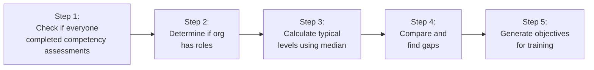
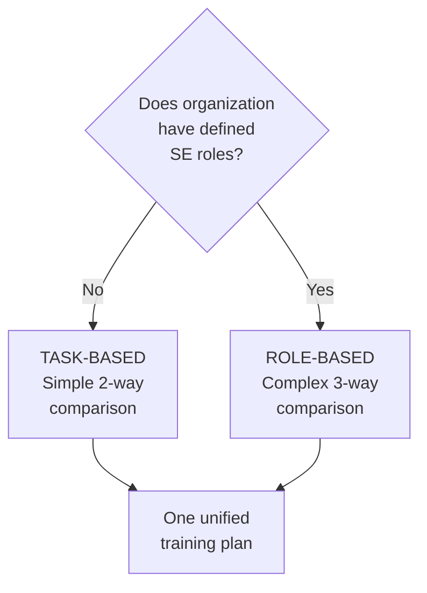
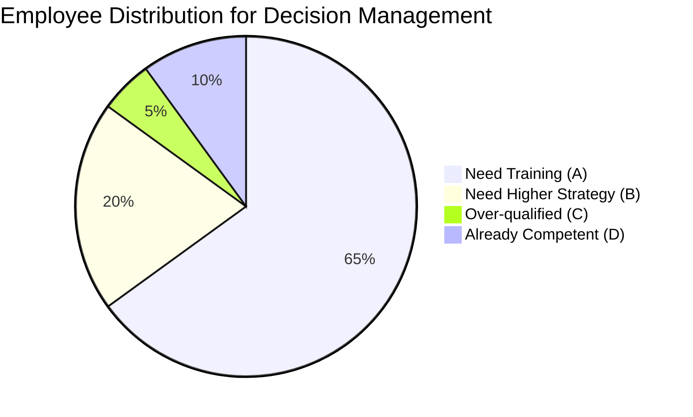

# Learning Objectives Generation - Summary

---

## What This System Does in Simple Terms

The Learning Objectives Generation system is like a **smart curriculum planner** that:
1. **Analyzes** where employees are now (current competency levels)
2. **Determines** where they need to be (based on training strategy and role requirements)
3. **Generates** specific learning objectives to bridge the gap
4. **Recommends** adjustments if the selected training won't meet all needs

---

## Two Types of Organizations

### Type 1: Low Maturity (Just Starting with SE)
- **No formal roles** defined yet
- Employees describe their daily tasks
- System uses **simpler 2-way comparison**
- Compares: Current Level vs Training Goal

### Type 2: High Maturity (Established SE Practices)
- **Has defined roles** (Developer, Manager, etc.)
- Employees select their roles
- System uses **complex 3-way comparison**
- Compares: Current Level vs Training Goal vs Role Needs

---

## The Algorithm in 5 Simple Steps



---

## Key Decision: Which Pathway?



---

## How We Find the "Typical" Employee Level

Instead of using the average (which gives invalid numbers like 2.7), we use the **MEDIAN**:

**Example with 5 employees:**
```
Scores: 1, 2, 2, 4, 6
Sorted: 1, 2, [2], 4, 6
         ↑     ↑     ↑
      below  MEDIAN  above

Median = 2 (the middle value)
This is the "typical" employee level
```

---

## The Comparison Logic

### For Organizations WITHOUT Roles (2-Way):
```
Current Level: 2 (from assessments)
Strategy Target: 4 (from template)

Is 2 < 4? YES
→ Generate objective to go from 2 to 4
```

### For Organizations WITH Roles (3-Way):
```
Current Level: 2 (from competency assessments)
Strategy Target: 4 (from strategy template)
Role Requirement: 6 (from role competency matrix)

Scenario Check:
- Is 2 < 4? YES
- Is 4 ≤ 6? YES
→ This is Scenario A (normal training)
→ Generate objective to go from 2 to 4
→ Note that role needs more (future training)
```

---

## Making Strategic Decisions

The system counts how many employees fall into each scenario:



**Decision Rules:**
- If >60% need higher strategy → Recommend additional/replace with better suiting strategy
- If 20-60% need higher → Suggest supplementary modules
- If <20% need higher → Note for future iteration

---

## Final Output: One Training Plan

Despite analyzing multiple roles and employees, the system produces **ONE unified training plan** for the organization:

```
Organization 28 Training Plan
├── Strategy 1: Needs-Based Project (PRIMARY)
│   ├── 12 Learning Objectives Generated
│   ├── 180 Hours Total Training
│   └── 85% of Employees Need This
├── Strategy 2: SE for Managers (SUPPLEMENTARY)
│   └── 8 Learning Objectives Generated
├── Recommendations
│   └── Consider "Certification" for advanced roles
└── Future Pipeline
    └── 3 Competencies need higher levels next cycle
```

---

## Why This Design?

### 1. **Statistical Validity**
- Requires 70% completion for meaningful results
- Uses median for robust aggregation
- Handles outliers properly

### 2. **Organizational Reality**
- Low maturity orgs genuinely don't have roles
- High maturity orgs have complex role structures
- One plan is more practical than many

### 3. **Future Growth**
- Task-based orgs evolve to role-based
- System tracks what's needed for next iteration
- Recommendations guide strategic evolution

### 4. **Practical Implementation**
- Generates actionable objectives
- Links to Phase 3 module planning
- Provides clear training hours and impact

---

## Critical Points to Remember

1. **Assessment First, Objectives Second**
   - Employees complete competency assessments
   - THEN system generates learning objectives
   - Never the reverse

2. **Latest Data Only**
   - Uses only most recent assessment per employee
   - Ignores retakes and test data
   - Ensures current state accuracy

3. **Core Competencies Exception**
   - 4 competencies can't be directly trained
   - They develop through other training
   - System notes this appropriately

4. **One Organization, One Plan**
   - Even with multiple roles and varied employees
   - System produces unified objectives
   - Simplifies training management

---

## Success Metrics

The system successfully generates learning objectives when:
- ✅ At least 70% of employees have completed assessments
- ✅ Organization has completed Phase 1 (maturity and strategy selection)
- ✅ Valid competency levels are calculated (0, 1, 2, 4, or 6)
- ✅ Appropriate comparison method is applied (2-way or 3-way)
- ✅ Output includes objectives for all selected strategies
- ✅ Recommendations align with user distribution patterns

---

## Questions This System Answers

1. **What training do our employees need?**
   → Specific objectives per competency

2. **Will our selected strategies meet all needs?**
   → Gap analysis and recommendations

3. **How many employees need each training?**
   → Impact percentages and user counts

4. **What should we plan for next?**
   → Future pipeline and iteration guidance

5. **How long will training take?**
   → Hour estimates per objective

---

*This executive summary provides a high-level understanding of the Learning Objectives Generation system without technical implementation details.*