# Learning Objectives Generation - Visual Flowcharts and Diagrams
**Supplementary Visual Documentation for Thesis Advisor**
**Date**: November 3, 2025

---

## Complete System Architecture

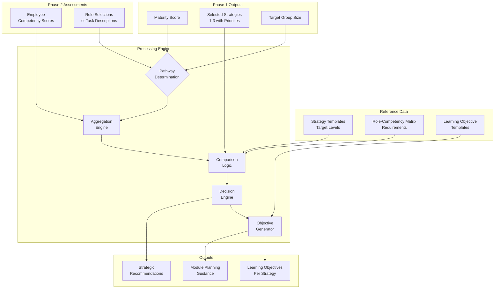

---

## Detailed Data Flow - Task-Based Pathway

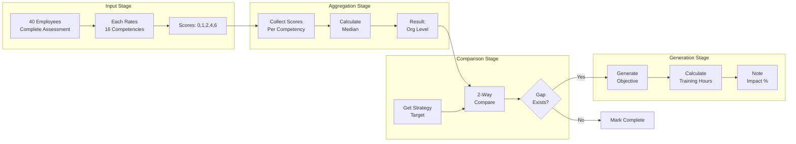

---

## Detailed Data Flow - Role-Based Pathway

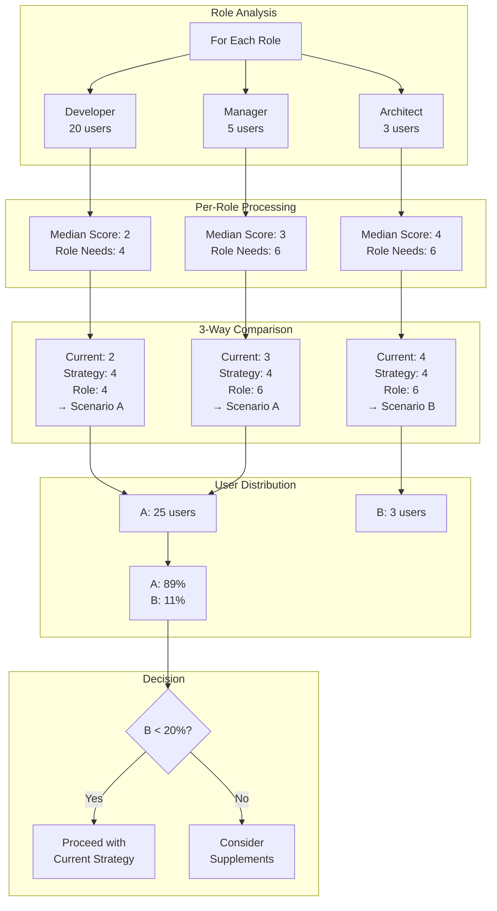

---

## Scenario Classification Logic

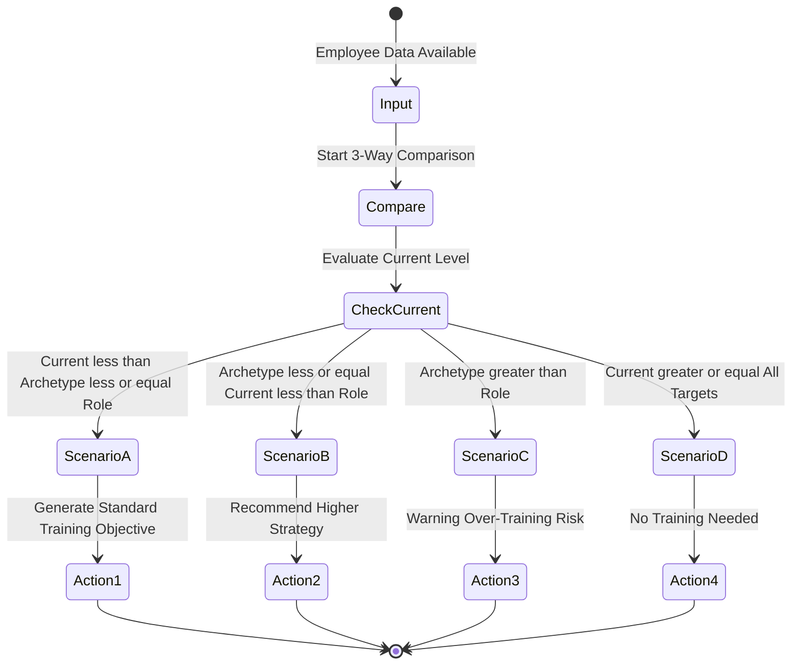

---

## Multi-Role User Handling

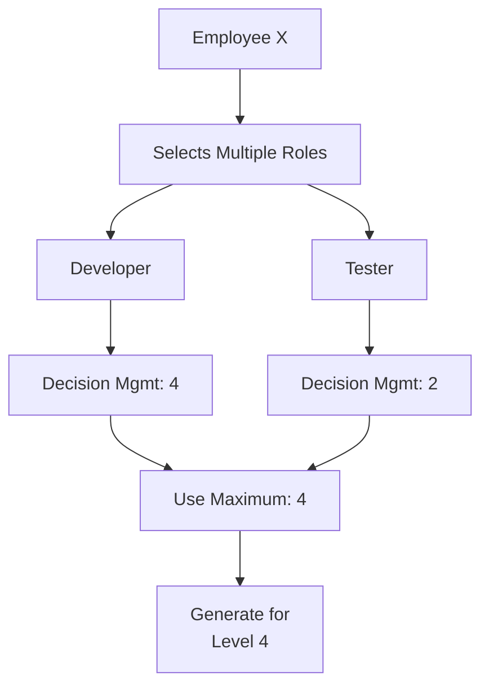

---

## Decision Thresholds Visualization

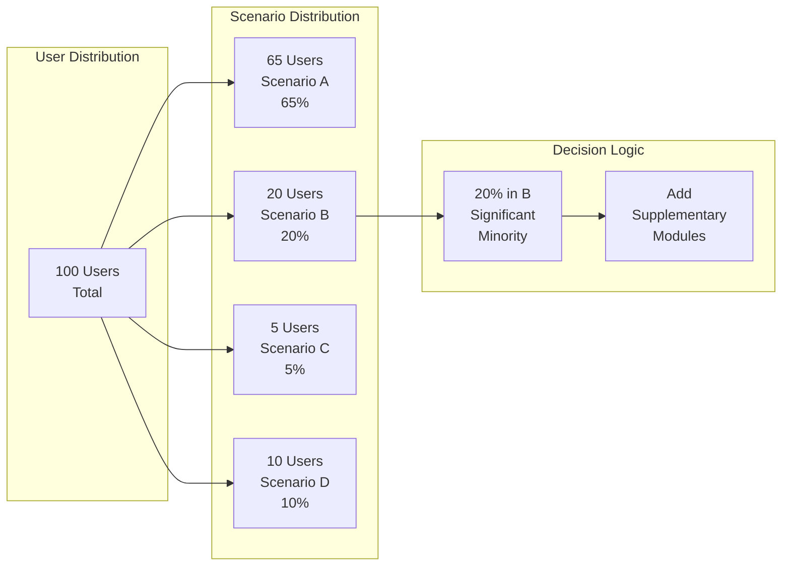

---

## Strategy Priority Processing

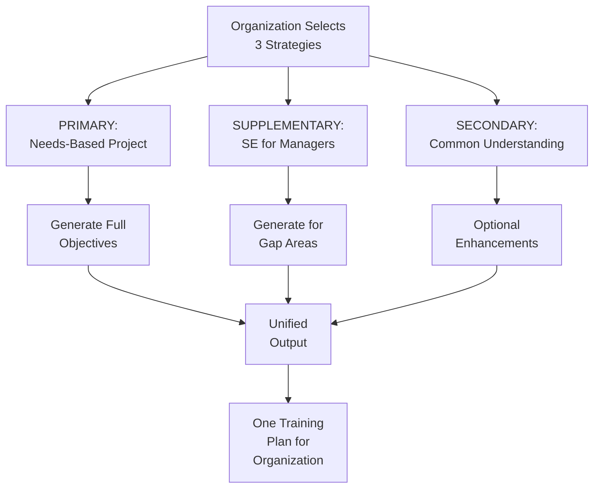

---

## Aggregation Methods Comparison

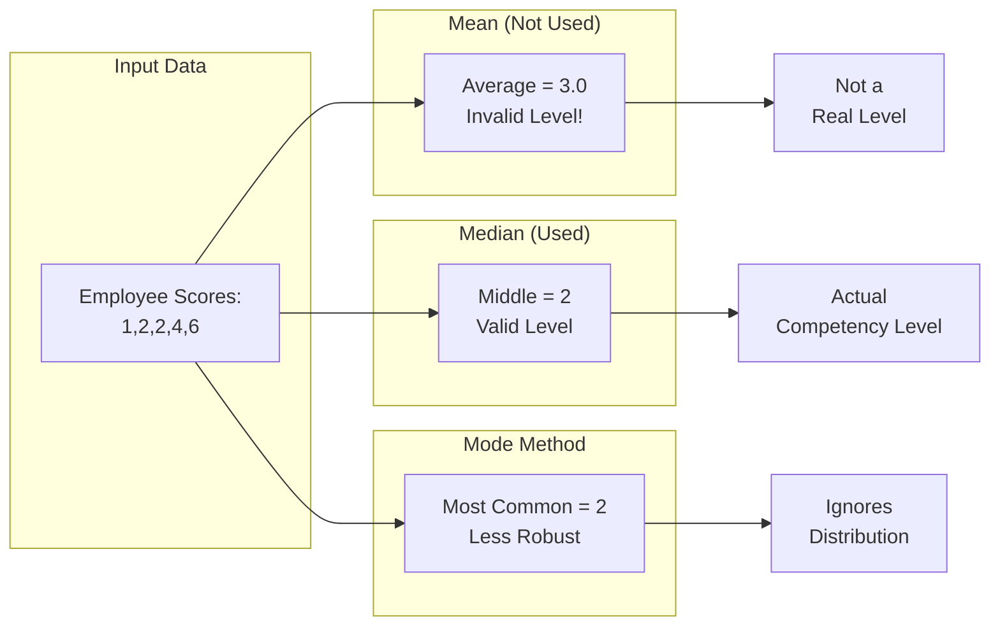

---

## Complete Example: Decision Management Competency

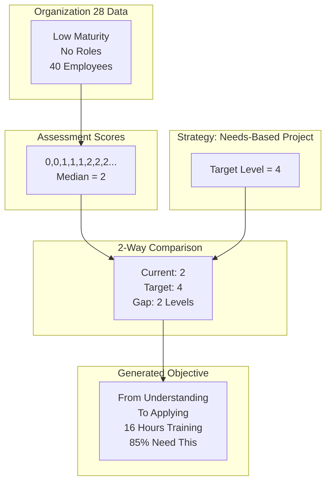

---

## Output Generation Flow

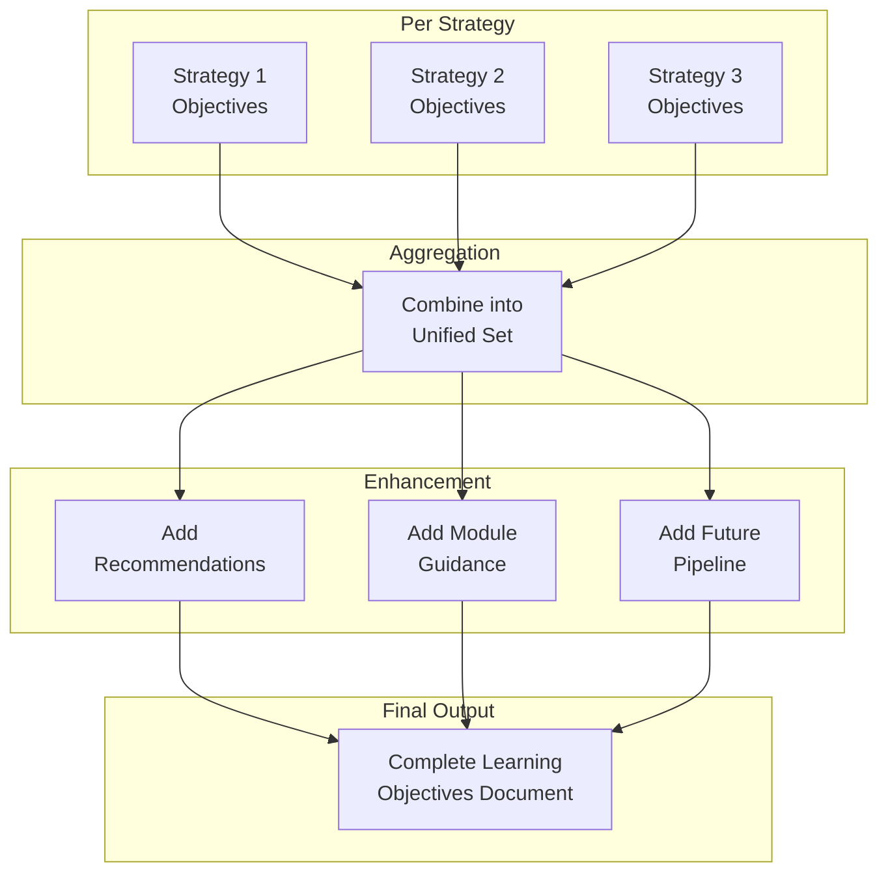

---

## Edge Case Handling

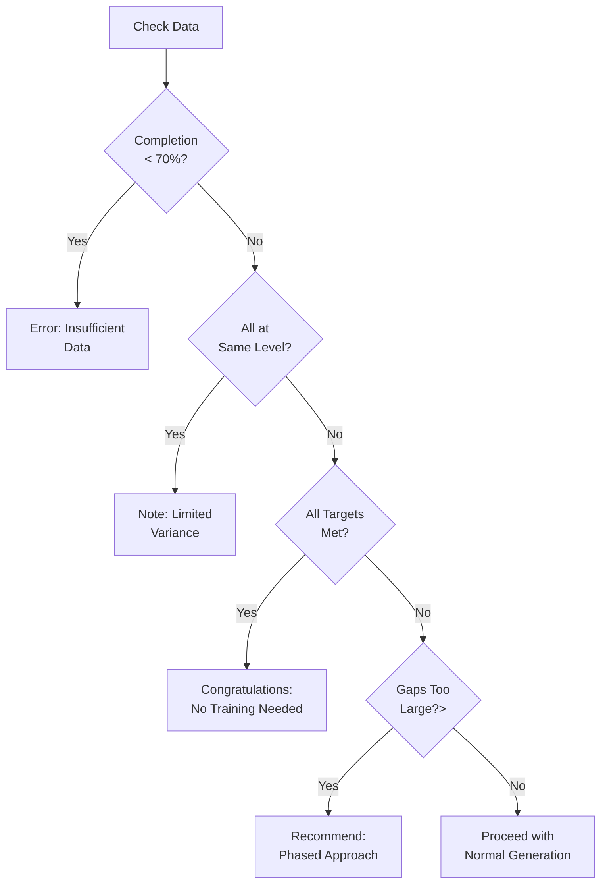

---

## System Validation Points

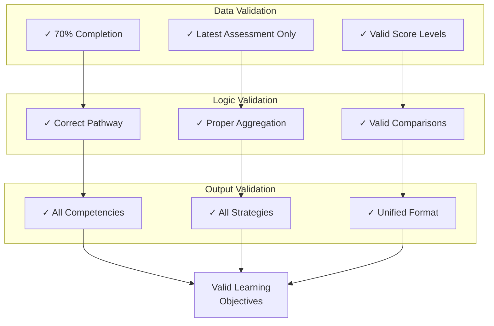

---

*These visual flowcharts complement the detailed text explanation, providing a graphical representation of the Learning Objectives Generation algorithm for easier comprehension.*