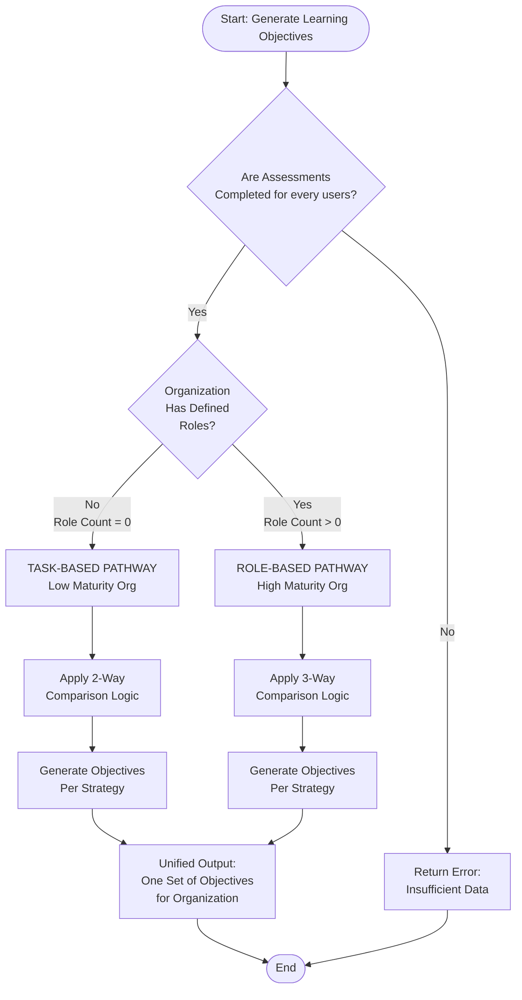
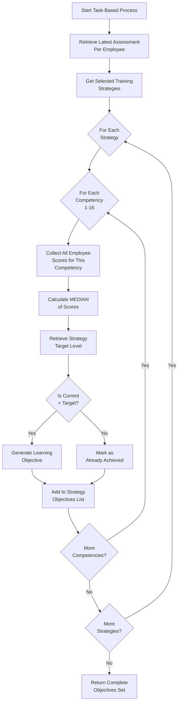
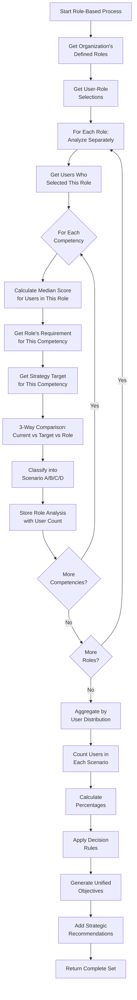
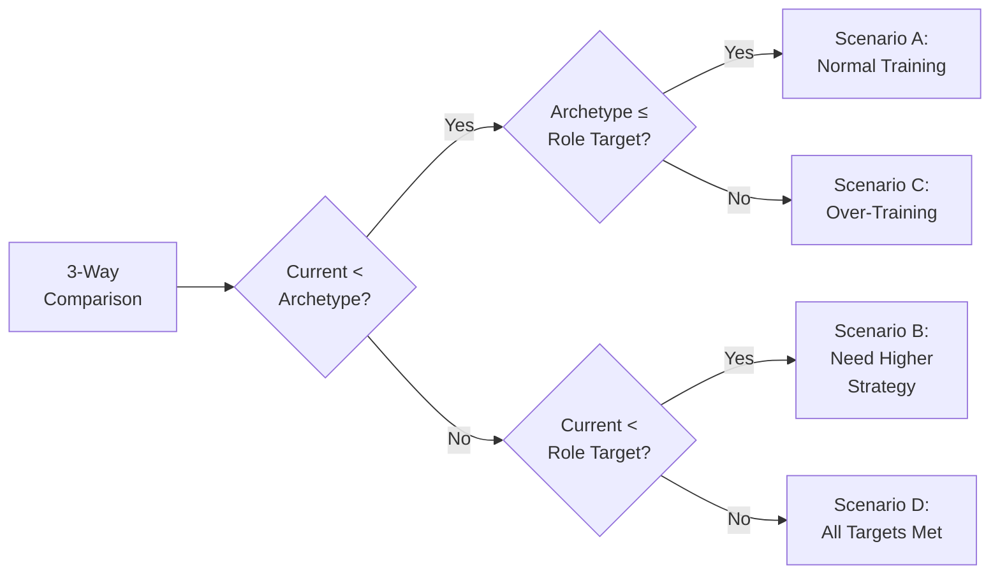
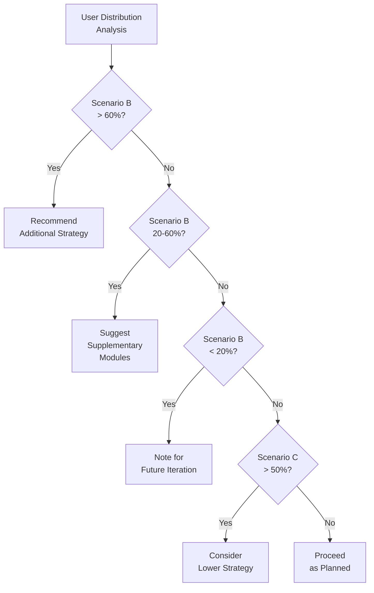
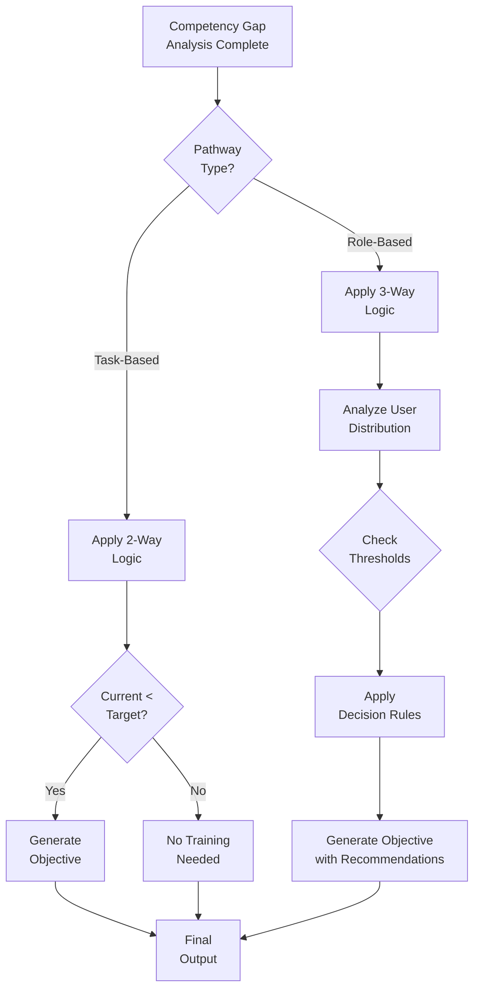

# Learning Objectives Generation Algorithm - Detailed Technical Explanation
**For Thesis Advisor - Non-Programming Technical Documentation**
**Date**: November 3, 2025

---

## Table of Contents
1. [System Overview](#system-overview)
2. [Main Algorithm Flowchart](#main-algorithm-flowchart)
3. [Pathway 1: Task-Based Organizations](#pathway-1-task-based-organizations)
4. [Pathway 2: Role-Based Organizations](#pathway-2-role-based-organizations)
5. [Data Aggregation Methods](#data-aggregation-methods)
6. [Decision Logic](#decision-logic)
7. [Example Walkthrough](#example-walkthrough)

---

## System Overview

The Learning Objectives Generation system operates as an automated decision engine that processes competency assessment data to produce customized training objectives. The system follows a deterministic algorithm with conditional branching based on organizational characteristics.

### Key System Components

1. **Input Data Sources**
   - Organization profile (maturity level, size)
   - Competency assessment results (individual employee scores)
   - Role definitions and requirements (if applicable)
   - Selected training strategies (1-3 strategies with priority levels)
   - Competency-strategy mapping templates

2. **Processing Engine**
   - Pathway determination logic
   - Data aggregation algorithms
   - Comparison engines (2-way or 3-way)
   - Decision rule application
   - Objective text generation

3. **Output Products**
   - Learning objectives per competency per strategy
   - Strategic recommendations
   - Module planning guidance
   - Future training pipeline

---

## Main Algorithm Flowchart



---

## Pathway 1: Task-Based Organizations

### Characteristics
- **Organizational Maturity**: Low (Level 1-2 on 5-point scale)
- **Role Definition Status**: NO formal SE roles exist
- **Data Source**: Employees describe their daily tasks
- **Comparison Type**: 2-Way (Current Level vs Strategy Target)

### Detailed Process Flow



### Task-Based Algorithm Steps

#### Step 1: Data Collection
- Query database for all employees in organization who completed assessment
- Filter to get ONLY the latest assessment per employee (ignore retakes)
- Retrieve assessment type = "unknown_roles" (task-based identifier)

#### Step 2: Strategy Processing Loop
For each selected strategy (e.g., "needs_based_project", "se_for_managers"):
- Retrieve strategy template containing target levels for all 16 competencies
- Process each competency individually

#### Step 3: Competency Analysis (2-Way Comparison)
For each of the 16 SE competencies:

1. **Aggregate Current Level**
   - Collect all employee scores for this competency
   - Calculate MEDIAN (middle value when sorted)
   - Result = Organizational current level for this competency

2. **Retrieve Target Level**
   - Look up strategy template for this competency
   - Get predefined target level (0, 1, 2, 4, or 6)

3. **Compare and Decide**
   - IF current_level < target_level:
     - Training needed
     - Generate learning objective
   - ELSE:
     - Target already achieved
     - Note as completed

#### Step 4: Objective Generation
When training is needed:
- Calculate gap size (target - current)
- Retrieve objective template for target level
- Customize with competency name and levels
- Add to objectives list

### Important Notes for Task-Based

- **NO role requirements exist** - organizations haven't defined roles yet
- **2-Way comparison only** - Current vs Strategy Target
- **Future enhancement**: After first training cycle, organization gains maturity and can define roles
- **Reference data**: Task-derived requirements stored but not used in main comparison

---

## Pathway 2: Role-Based Organizations

### Characteristics
- **Organizational Maturity**: High (Level 3-5 on 5-point scale)
- **Role Definition Status**: Custom roles defined (e.g., "Senior Developer", "Test Manager")
- **Data Source**: Employees select their roles and complete assessments
- **Comparison Type**: 3-Way (Current vs Strategy Target vs Role Requirement)

### Detailed Process Flow



### Role-Based Algorithm Steps

#### Step 1: Role Analysis Phase
For each role defined by the organization:

1. **Identify Users**
   - Find all employees who selected this role
   - Count = number of employees in this role
   - Store user IDs for tracking

2. **Competency Processing**
   For each of 16 competencies:
   - Calculate median of scores from users IN THIS ROLE
   - Retrieve this role's specific requirement
   - Retrieve strategy target level
   - Perform 3-way comparison
   - Classify result into scenario

#### Step 2: Scenario Classification (3-Way Comparison)



**Scenario Definitions:**
- **A**: Current < Archetype ≤ Role → Standard training path
- **B**: Archetype ≤ Current < Role → Strategy insufficient for role
- **C**: Archetype > Role → Strategy exceeds role needs
- **D**: Current ≥ both targets → No training needed

#### Step 3: User Distribution Analysis

After analyzing all roles individually:

1. **Aggregate Users by Scenario**
   - Count UNIQUE users in each scenario
   - Handle multi-role users (counted once)
   - Calculate percentages of total users

2. **Distribution Matrix Example**:
   ```
   Competency: Decision Management
   Total Users: 100

   Scenario A: 65 users (65%) - Need training
   Scenario B: 20 users (20%) - Need higher strategy
   Scenario C: 5 users (5%)   - Over-qualified
   Scenario D: 10 users (10%) - Targets met
   ```

#### Step 4: Strategic Decision Making

Based on user distribution percentages:



#### Step 5: Generate Unified Objectives

Despite multiple roles with different requirements:
1. Calculate organizational median (ALL users)
2. Use strategy target as training goal
3. Generate ONE objective per competency
4. Note distribution in metadata
5. Add recommendations based on patterns

---

## Data Aggregation Methods

### Method 1: Median for Current Levels

**Purpose**: Find typical employee competency level

**Process**:
1. Collect all scores: [1, 2, 2, 4, 6]
2. Sort ascending: [1, 2, 2, 4, 6]
3. Find middle value: 2 (position 3 of 5)
4. Result: Typical employee is at level 2

**Why Median?**
- Returns actual competency level (not 2.7)
- Robust to outliers (one expert doesn't skew)
- Valid for ordinal data (levels aren't equally spaced)

### Method 2: Maximum for Role Requirements (Simplified)

**Purpose**: Ensure training covers most demanding role

**Process**:
1. List all role requirements for competency
2. Role A needs: Level 4
3. Role B needs: Level 2
4. Role C needs: Level 6
5. Maximum = 6
6. Result: Train to accommodate highest need

### Method 3: Distribution Analysis (Advanced)

**Purpose**: Understand organizational needs pattern

**Process**:
1. Count users in each scenario
2. Calculate percentages
3. Apply decision thresholds
4. Generate recommendations

---

## Decision Logic

### Primary Decision Tree



### Decision Thresholds

| User Percentage | Scenario | Action | Rationale |
|-----------------|----------|---------|-----------|
| >60% need higher | B | Recommend additional strategy | Majority underserved |
| 20-60% need higher | B | Add supplementary modules | Significant minority |
| <20% need higher | B | Note for future | Small group |
| >50% over-trained | C | Consider lower strategy | Waste of resources |

---

## Example Walkthrough

### Organization Profile
- **Organization ID**: 28
- **Maturity Level**: 1.7 (Low)
- **Defined Roles**: 0 (None)
- **Employees Assessed**: 40
- **Pathway**: TASK-BASED

### Selected Strategies
1. **PRIMARY**: Needs-based project-oriented training
2. **SUPPLEMENTARY**: SE for Managers
3. **SECONDARY**: Common understanding

### Example Competency: Decision Management

#### Step 1: Collect Employee Scores
```
40 employees assessed for Decision Management:
Scores: [0,0,1,1,1,1,2,2,2,2,2,2,2,2,2,2,2,2,2,2,
         2,2,2,2,2,2,4,4,4,4,4,4,4,4,6,6,6,6,6,6]
```

#### Step 2: Calculate Median
- Sort: Already sorted
- Count: 40 values
- Middle positions: 20th and 21st
- Values at positions: 2 and 2
- Median = (2+2)/2 = 2

#### Step 3: Get Strategy Target
- Strategy: "needs_based_project"
- Target for Decision Management: Level 4

#### Step 4: 2-Way Comparison
- Current: 2
- Target: 4
- Current < Target? YES
- Action: Generate learning objective

#### Step 5: Generate Objective
```
Learning Objective:
"By the end of this training, participants will be able to
prepare complex decisions using systematic approaches, evaluate
alternatives using decision matrices, and communicate decisions
effectively to stakeholders, progressing from Understanding
(Level 2) to Applying (Level 4) decision management competencies."

Gap: 2 levels
Estimated Hours: 16
Users Requiring: 34 of 40 (85%)
```

### Final Output Structure

```
Organization 28 Learning Objectives
├── Strategy: needs_based_project (PRIMARY)
│   ├── Competency 1: Systems Thinking
│   │   └── Note: Core competency - develops indirectly
│   ├── Competency 11: Decision Management
│   │   ├── Current: 2
│   │   ├── Target: 4
│   │   ├── Gap: 2
│   │   └── Objective: [Generated text]
│   └── ... (14 more competencies)
│
├── Strategy: se_for_managers (SUPPLEMENTARY)
│   └── [Similar structure]
│
└── Recommendations:
    └── None (task-based pathway, sufficient coverage)
```

---

## Critical Design Principles

### 1. One Unified Output
Despite multiple roles or user variations, the system generates ONE set of learning objectives per strategy for the entire organization, not separate plans per role.

### 2. Latest Assessment Only
System uses only the most recent assessment per employee. Previous attempts, retakes, or test data are explicitly excluded from calculations.

### 3. Minimum Data Requirement
At least 70% of employees must complete assessments before objectives can be generated. This ensures statistical validity and organizational representation.

### 4. Core Competencies Exception
Competencies 1, 4, 5, and 6 (Systems Thinking, Lifecycle Consideration, Customer Orientation, Systems Modeling) cannot be directly trained. They develop indirectly through other competencies.

### 5. Pathway Determines Comparison
- Task-based → 2-way comparison only
- Role-based → 3-way comparison with distribution analysis

### 6. Aggregation Consistency
Always use median for current levels to ensure robust, valid competency levels that exist in the framework.

---

## Appendix: Data Structures

### Input Tables

**1. Organization Table**
| Field | Purpose |
|-------|---------|
| organization_id | Unique identifier |
| maturity_score | Determines pathway |
| phase1_completed | Prerequisites check |

**2. User Assessment Table**
| Field | Purpose |
|-------|---------|
| user_id | Employee identifier |
| organization_id | Link to organization |
| survey_type | "known_roles" or "unknown_roles" |
| selected_roles | Array of role IDs (if applicable) |
| completed_at | Timestamp for latest check |

**3. Competency Results Table**
| Field | Purpose |
|-------|---------|
| user_id | Link to employee |
| competency_id | Which of 16 competencies |
| score | Actual level (0,1,2,4,6) |
| submitted_at | For latest filtering |

**4. Role Competency Matrix**
| Field | Purpose |
|-------|---------|
| role_id | Which role |
| competency_id | Which competency |
| role_competency_value | Required level |

**5. Strategy Templates**
| Field | Purpose |
|-------|---------|
| strategy_id | Which training strategy |
| competency_id | Which competency |
| target_level | Training target |

### Output Structure

**Learning Objectives Generated**
| Field | Content |
|-------|---------|
| organization_id | Who this is for |
| pathway | "TASK_BASED" or "ROLE_BASED" |
| objectives_by_strategy | Nested structure per strategy |
| recommendations | Strategic guidance |
| future_pipeline | Gaps for next iteration |

---

*This document provides a complete technical explanation of the Learning Objectives Generation algorithm without programming code, suitable for academic review and system understanding.*